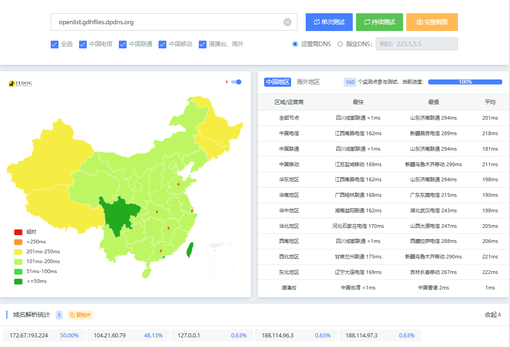
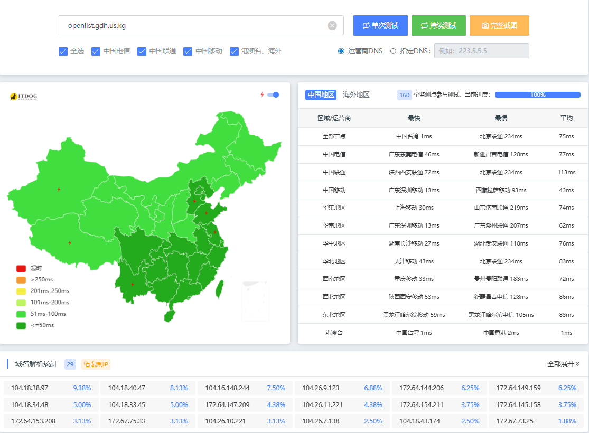
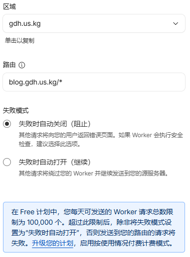
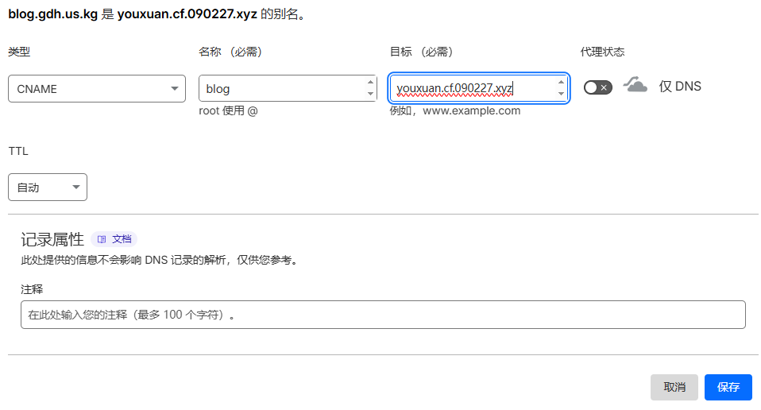
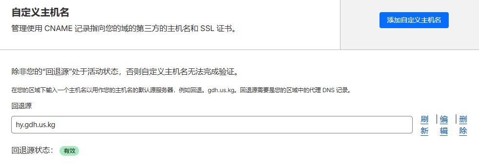
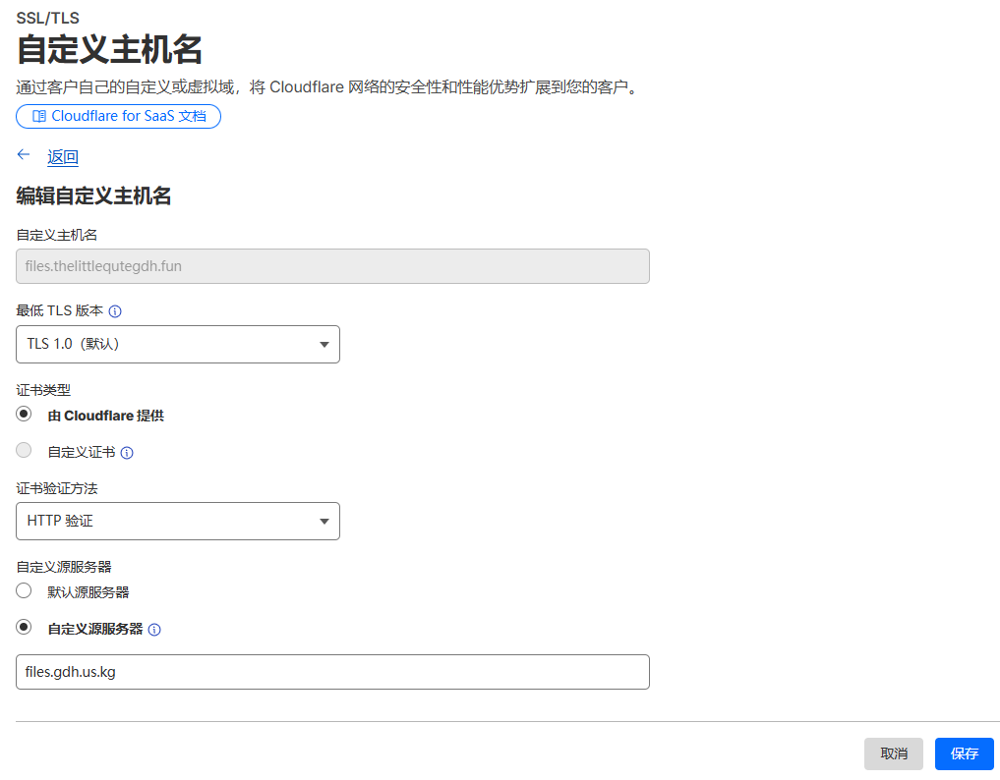
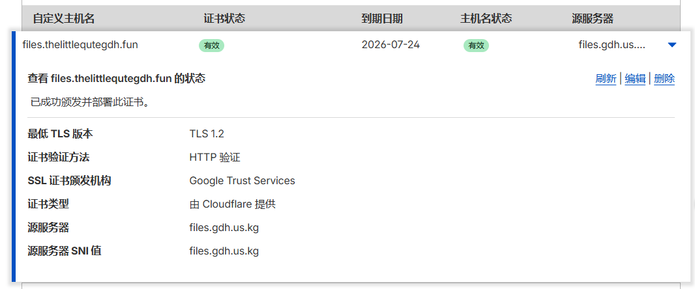
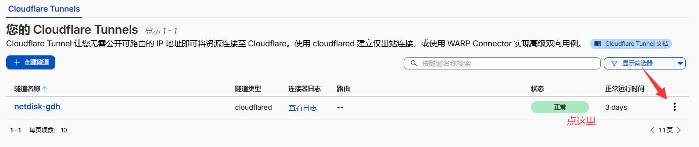
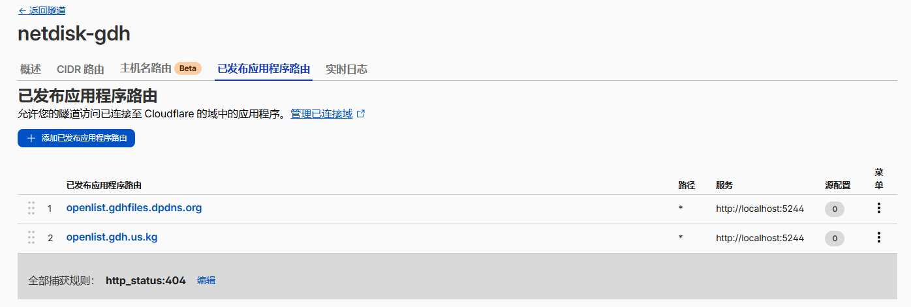

## Cloudflare优选教程

总所周知，Cloudflare被称为“赛博大善人”，它的大多数服务都是免费的。但Cloudflare的服务器在国外，国内Ping下来延迟普遍在150ms以上，非常慢，所以我们要借助国内优选来解决这个问题。
优选之后，先来看看效果图

未优选：

可以看到Cloudflare默认只分配了5个IP

已优选：

可以看到是全绿的，解析出来的IP变多

## 准备工作：

| 一个优选域名（我使用的是CM大佬的[https://cf.090227.xyz](https://cf.090227.xyz/)域名） |
| :----------------------------------------------------------: |
|                      一个Cloudflare账号                      |
| 两个域名（如果是非Saas优选的只需要一个域名，Saas优选需要两个域名） |
| 一个已绑定国外银行卡的Paypal的账户或者单独一张银行卡（开通自定义主机名的时候需要使用，实测可以使用银联卡） |

## 单域名优选

### Worker优选

Worker优选是最简单的，前提是你需要提前把域名绑定到Cloudflare，主要是以下两种情况的优选：

#### 1、你的项目部署在Worker

首先，访问并登录你的Cloudflare，然后在左侧的菜单栏中找到`计算`→`Workers 和 Pages`

找一个你已经搭建好的CF Workers，点击三个点`查看设置`，再点击设置，找到`域和路由`，点击`添加`→`路由`，区域为已经绑定到Cloudflare的域名，比如说我在Cloudflare已经绑定了gdh.us.kg，那么你需要在在区域处直接选择gdh.us.kg，路由处填写你在区域处选择的域名，可自定义前缀，如：blog.gdh.us.kg，123.gdh.us.kg，然后点击`添加路由`

> [!WARNING]
>
> 一定要注意，添加的域名一定要带“/*”,如下图：



回到你的域名，为你的域名添加一条记录，如果你使用不带前缀的域名，如gdh.us.kg，就直接添加一条@的CNAME记录，如果你像我一样使用带前缀的域名，如blog.gdh.us.kg，就添加一条带前缀的CNAME记录，接着目标填上社区优选域名，比如我找的是youxuan.cf.090227.xyz，需要关闭小黄云，点击保存。


#### 2、反代源站

> [摘自试试Cloudflare IP优选！让Cloudflare在国内再也不是减速器！ | 二叉树树的博客](https://blog.2x.nz/posts/cf-fastip/)

> [!note]
>
> 本方法的原理为通过Worker反代你的源站，然后将Worker的入口节点进行优选。此方法不是传统的优选，源站接收到的Hosts头仍然是直接指向源站的解析

创建一个Worker，输入以下的代码：（原站.com写你需要优选的域名，最终访问头写你的访问头，访问头随便写就行。比如说你的原站为gdhslow.dpdns.org，访问头随便写一个写"fastip"）

```
// 域名前缀映射配置
const domain_mappings = {
  '源站.com': '最终访问头.',
//例如：
//'gitea.072103.xyz': 'gitea.',
//则你设置Worker路由为gitea.*都将会反代到gitea.072103.xyz
};

addEventListener('fetch', event => {
  event.respondWith(handleRequest(event.request));
});

async function handleRequest(request) {
  const url = new URL(request.url);
  const current_host = url.host;

  // 强制使用 HTTPS
  if (url.protocol === 'http:') {
    url.protocol = 'https:';
    return Response.redirect(url.href, 301);
  }

  const host_prefix = getProxyPrefix(current_host);
  if (!host_prefix) {
    return new Response('Proxy prefix not matched', { status: 404 });
  }

  // 查找对应目标域名
  let target_host = null;
  for (const [origin_domain, prefix] of Object.entries(domain_mappings)) {
    if (host_prefix === prefix) {
      target_host = origin_domain;
      break;
    }
  }

  if (!target_host) {
    return new Response('No matching target host for prefix', { status: 404 });
  }

  // 构造目标 URL
  const new_url = new URL(request.url);
  new_url.protocol = 'https:';
  new_url.host = target_host;

  // 创建新请求
  const new_headers = new Headers(request.headers);
  new_headers.set('Host', target_host);
  new_headers.set('Referer', new_url.href);

  try {
    const response = await fetch(new_url.href, {
      method: request.method,
      headers: new_headers,
      body: request.method !== 'GET' && request.method !== 'HEAD' ? request.body : undefined,
      redirect: 'manual'
    });

    // 复制响应头并添加CORS
    const response_headers = new Headers(response.headers);
    response_headers.set('access-control-allow-origin', '*');
    response_headers.set('access-control-allow-credentials', 'true');
    response_headers.set('cache-control', 'public, max-age=600');
    response_headers.delete('content-security-policy');
    response_headers.delete('content-security-policy-report-only');

    return new Response(response.body, {
      status: response.status,
      statusText: response.statusText,
      headers: response_headers
    });
  } catch (err) {
    return new Response(`Proxy Error: ${err.message}`, { status: 502 });
  }
}

function getProxyPrefix(hostname) {
  for (const prefix of Object.values(domain_mappings)) {
    if (hostname.startsWith(prefix)) {
      return prefix;
    }
  }
  return null;
}

```

复制好上方的代码并创建Worker后，点击设置，找到`域和路由`，点击`添加`-`路由`，区域为你已经绑定到Cloudflare的域名，比如说我在Cloudflare已经绑定了gdh.us.kg，那你在区域那里选择gdh.us.kg，路由需要填写你的访问头+你绑定到Cloudflare的域名，比如刚刚提到访问头为fastip，则你的域名为fastip.gdh.us.kg，添加记录后，请在你的域名下面添加一个fast的记录，记录值为你的优选域名

> [!warning]
>
> 这里一定要注意，添加的域名一定要带“/*”

### Pages优选

> Pages的优选会比Worker的优选麻烦一点，建议将Pages转成Worker，详情可以看这条视频：[CF Page一键迁移到Worker？好处都有啥？By 二叉树树](https://www.bilibili.com/video/BV1wBTEzREcb)

CloudflarePages的好处：可以绑定不在Cloudflare托管的其他域名。

如果你嫌弃太麻烦，将你绑定的域名托管到阿里云\华为云\腾讯云等其他云解析做线路分流解析，但是考虑到有些为二级域名，不一定绑定成功，所以这个办法对二级域名不是很友好，目前来看成功绑定的只有us.kg域名
详情可以看以下这篇文章

> [加速你的项目！详解 Cloudflare Workers & Pages 优选域名设置 | CMLiussss Blog](https://blog.cmliussss.com/p/BestWorkers/) By CMLiussss

如果实在不行，可以尝试套其他平台的CDN，比如EdgeoneCDN，阿里云ESA，这些都有免费套餐，亦或者是使用Saas优选，但是很麻烦，具体可以看下方教程


### Cloudflare R2存储桶的优选

由于本人没有存储桶实例，所以这里不做教程介绍，详情可以去看看二叉树树的优选教程

> [试试Cloudflare IP优选！让Cloudflare在国内再也不是减速器！ | 二叉树树的博客](https://2x.nz/posts/cf-fastip/)


## 接下来的教程需要两个域名，建议将域名都绑定在Cloudflare上

### 传统的Saas优选（确保至少一个域名绑定在CF上）

这个优选方法适用于未使用cloudflare托管，但却又想使用Cloudflare CDN服务的域名，无需更改NS名称服务器

首先，我这里有两个域名，一个gdh.us.kg（作为辅助域名，辅助域名必须托管到Cloudflare），一个thelittlequtegdh.top域名（主力域名，给别人展示的域名，这个主力域名不一定要托管到Cloudflare）

添加一条记录，名称随便起，记录类型A或CNAME都可以，地址需要填写你的源服务器地址，也就是源站，并打开小黄云，保存

~~再添加一个记录，名称随便起，比如这里叫cdn，类型选择CNAME，目标为你的社区优选域名，比如这里为youxuan.cf.090227.xyz，点击保存。~~

**2026年8月实测：不需要这个记录，直接填写优选域名也可以正常访问网站，不知道Cloudflare能否解析**

在左侧侧边栏点开`SSL/TLS`→`自定义主机名`，这里需要添加一个付款方式才能进来，实测可以使用银联卡/已添加银行卡的Paypal账户，回退源为你刚刚添加的原站域名，**注意：回退源不能为根域名！！**



点击自定义主机名，自定义主机名填写你的主力域名，例如我这里写files.thelittlequtegdh.fun，证书验证方法这里改为HTTP验证，自定义源服务器填写你刚刚添加的指向源站的记录，点击确定



随后Cloudflare会让你验证TXT记录，回到你的主力域名，给你的主力域名添加Cloudflare要求验证的记录

> [!note]
> 类型：TXT
> 名称：_cf-custom-hostname.你的域名
> 值为Cloudflare给你提供的值，比如说1784f76d-xxxx-xxxx-xxxx-998dfe1a52ea
> 注意，如果你的域名为“你的域”，没有任何前缀，则你需要删除`.你的域`，


等待生效时，回到主力域名，添加一条Cname记录，为你刚刚添加的自定义主机名，我这里叫files.thelittlequtegdh.fun。则名称为files，类型Cname，目标为你刚刚的添加为辅助域名添加优选域名的记录，我的为cdn.gdh.us.kg，如果你的主力域名绑定在Cloudflare，请关闭小黄云，点击保存

等到你的主机名状态和证书状态变为有效后，访问你的域名，如果正常访问即可。



### Cloudflare Tunnel优选

需要一个备用域名和一个主力域名，这里备用为files.gdhfiles.dpdns.org，主力域名为gdh.us.kg。请按照上方教程添加好回退源

首先，你需要添加一个隧道，回到首页在左侧侧边栏打开Zero Trust，可能这里也需要一个支付方式才能进来，但是这里可以不用添加，回到首页dash.cloudflare.com再进来就不会出现付款方式了，点击网络Networks，点击连接器Connectors，你需要在这里添加一条隧道，我这里就添加了openlist的localhost:5244作为内网。按照它的步骤添加

等到状态变为“正常”后，点击它右边的三个点，点击`配置`



点击`已发布程序路由`-`添加已发布程序路由`，添加你的主力域名，我的是openlist.gdh.us.kg，内网依旧localhost:5244，点击添加，如果你的域名是托管到非Cloudflare的其他云托管商，你只需要输入你的域名，点击搜索即可添加
这个方法并不会为你的非Cloudflare域名添加任何记录，如果你偏要添加（其实我认为添加了也用不了，因为其他服务厂商没有小黄云[doge][doge]），那么你只需要找你当时第一次创建隧道时绑定的域名，将他的DNS记录值添加上去即可



接着回到你的主力域名，打开DNS记录会发现Tunnel默认给你分配了一条指向netdisk-gdh的记录，删掉他，接着创建一条记录，名称为openlist，就是你在添加主力域名时的前缀，然后记录填写你刚刚在辅助域名处添加的优选域名记录，我这里是cdn.gdhfiles.dpdns.org，点击保存

打开你的辅助域名，跟Saas优选一样，打开自定义主机名后，回退源添加为你的源站，也就是辅助域名，然后点击添加，接着在添加自定义主机名，同样的跟Saas优选一样的步骤，添加完后验证，验证完成，恭喜你，你已经学会了CF Tunnel优选

## 参考资料

> [试试Cloudflare IP优选！让Cloudflare在国内再也不是减速器！ | 二叉树树的博客](https://blog.2x.nz/posts/cf-fastip/)
>
> [告别龟速！Cloudflare 优选 IP 傻瓜式教程，单域名也能让网站起飞-传家宝VPS - 深度VPS测评 | 高性价比VPS推荐 | 2025海外云服务器排行榜](https://www.legacyvps.com/archives/cloudflare-speed-optimization-preferred-ip-guide-single-domain)
>
> [加速你的项目！详解 Cloudflare Workers & Pages 优选域名设置 | CMLiussss Blog](https://blog.cmliussss.com/p/BestWorkers/)
>
> [CloudFlare优选域名汇总 - CF优选域名](https://cf.090227.xyz/)

