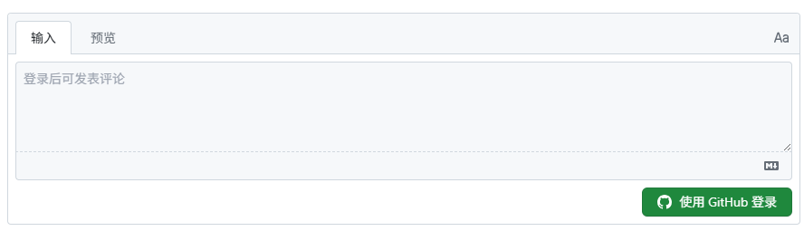
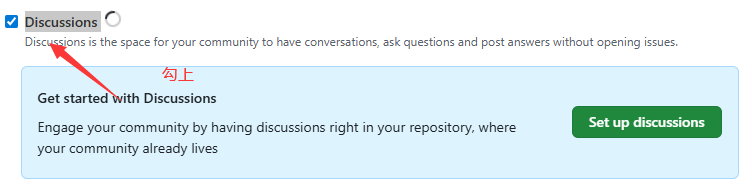
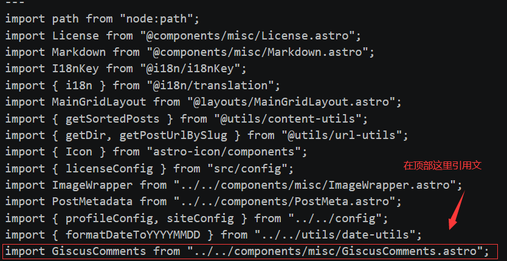
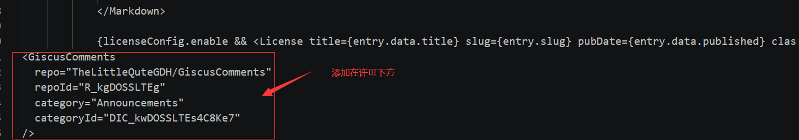

<<<<<<< HEAD
---
title: 如何给Fuwari主题添加Giscus评论区
published: 2026-05-02
description: ''
image: 'photo/Giscus评论区.png'
tags: [博客搭建]
category: '教程'
draft: false 
lang: ''


---

相信大家都能在某些神秘博客里看见这种主题像Github的评论区，如下图：



那么，Astro-Fuwari该怎么搭建这该死的评论呢？哎，我有一计！

## 准备工作

1个Github的新存储库

## 存储库安装Giscus

首先，打开你的新存储库，点开`Settings`，接着往下滑，滑到一个带`Discussions`字样时，将前面的对勾选上，如下图：



接着，访问[Giscus官网](https://giscus.app/zh-CN)，滑倒仓库板块，找到`[giscus app](https://github.com/apps/giscus)  已安装，否则访客将无法评论和回应`，点击那里的`giscus app`，进到安装页面后，选择`Only select repositories` ，选择你刚刚开启了`Discussions`的仓库，点击`Save`，初步的安装就完成了

回到[giscus](https://giscus.app/zh-CN)，往下滑，回到`仓库`板块，填写你的Github用户名/仓库名，我这里是TheLittleQuteGDH/GiscusComments，等到出现`成功！该仓库满足所有条件。`字样时，那么请进行下一步，如果显示`无法在该仓库上使用 giscus。请确保以上条件均已满足。`，请从第一步重新开始检查。

下面配置，说一下我的：（按自己需求进行配置）

建议勾选**使用严格的标题匹配**，防止一个评论被用于多篇博客，Discussion 分类请选择`Announcements`，我勾选了`懒加载评论`和`将评论框放在评论上方， 主题我就选择用户偏好，在`启用Giscus`中，复制或记住代码，比如我是

```
<script src="https://giscus.app/client.js"
        data-repo="Your data-repo"
        data-repo-id="Your data-repo-id"
        data-category="Announcements"
        data-category-id="Your data-category-id"
        data-mapping="pathname"
        data-strict="0"
        data-reactions-enabled="1"
        data-emit-metadata="0"
        data-input-position="bottom"
        data-theme="preferred_color_scheme"
        data-lang="zh-CN"
        crossorigin="anonymous"
        async>
</script>
```


## Fuwari的配置

1、在\src\components\misc创建一个GiscusComments.astro文件，并写入以下内容：

```
---
interface Props {
  repo: string;
  repoId: string;
  category: string;
  categoryId: string;
  mapping?: string;
  reactionsEnabled?: boolean;
  emitMetadata?: boolean;
  inputPosition?: 'top' | 'bottom';
  lang?: string;
}

const {
  repo,
  repoId,
  category,
  categoryId,
  mapping = 'pathname',
  reactionsEnabled = true,
  emitMetadata = false,
  inputPosition = 'bottom',
  lang = 'zh-CN'
} = Astro.props;
---

<div id="giscus-container"></div>

<script define:vars={{ repo, repoId, category, categoryId, mapping, reactionsEnabled, emitMetadata, inputPosition, lang }}>
  function loadGiscus() {
    const container = document.getElementById('giscus-container');
    if (!container) return;

    // 获取当前主题
    const isDark = document.documentElement.classList.contains('dark');
    const theme = isDark ? 'dark' : 'light';

    // 创建Giscus脚本
    const script = document.createElement('script');
    script.src = 'https://giscus.app/client.js';
    script.setAttribute('data-repo', repo);
    script.setAttribute('data-repo-id', repoId);
    script.setAttribute('data-category', category);
    script.setAttribute('data-category-id', categoryId);
    script.setAttribute('data-mapping', mapping);
    script.setAttribute('data-strict', '0');
    script.setAttribute('data-reactions-enabled', reactionsEnabled ? '1' : '0');
    script.setAttribute('data-emit-metadata', emitMetadata ? '1' : '0');
    script.setAttribute('data-input-position', inputPosition);
    script.setAttribute('data-theme', theme);
    script.setAttribute('data-lang', lang);
    script.setAttribute('data-loading', 'lazy');
    script.crossOrigin = 'anonymous';
    script.async = true;

    container.appendChild(script);
  }

  // 监听主题变化
  function updateGiscusTheme() {
    const giscusFrame = document.querySelector('iframe[src*="giscus"]');
    if (giscusFrame) {
      const isDark = document.documentElement.classList.contains('dark');
      const theme = isDark ? 'dark' : 'light';

      giscusFrame.contentWindow.postMessage({
        giscus: {
          setConfig: {
            theme: theme
          }
        }
      }, 'https://giscus.app');
    }
  }

  // 监听DOM变化来检测主题切换
  const observer = new MutationObserver((mutations) => {
    mutations.forEach((mutation) => {
      if (mutation.type === 'attributes' && mutation.attributeName === 'class') {
        updateGiscusTheme();
      }
    });
  });

  // 页面加载时初始化
  if (document.readyState === 'loading') {
    document.addEventListener('DOMContentLoaded', loadGiscus);
  } else {
    loadGiscus();
  }

  // 开始观察主题变化
  observer.observe(document.documentElement, {
    attributes: true,
    attributeFilter: ['class']
  });
</script>
```

2、修改\src\pages\posts的[...slug].astro文件，修改两处：

- 在顶部添加引用GiscusComments.astro文件的代码。
- 在许可下方处添加代码：（这里的参数在你刚刚获取的Giscus参数处）

```
import GiscusComments from "../../components/misc/GiscusComments.astro";
……
……
{licenseConfig.enable && <License title={entry.data.title} slug={entry.slug} pubDate={entry.data.published} class="mb-6 rounded-xl license-container onload-animation"></License>}

<GiscusComments
  repo="Your repo"
  repoId="Your repoId"
  category="Announcements"
  categoryId="Your categoryId"
/>
```





配置好后，打包push到Github上，部署完成就可以看到Giscus启用了

## 参考文献

[让你的fuwari有一个自适应的giscus评论区 - fulie blog](https://pcb.im/posts/giscus/)

[你是否在寻找一个评论系统而又不想自托管？又饱受垃圾评论的叨扰？ | 二叉树树的博客](https://blog.2x.nz/posts/giscus-akismet/)
=======
---
title: 如何给Fuwari主题添加Giscus评论区
published: 2026-05-02
description: ''
image: 'photo/Giscus评论区.png'
tags: [博客搭建]
category: '教程'
draft: false 
lang: ''

---

相信大家都能在某些神秘博客里看见这种主题像Github的评论区，如下图：


那么，Astro-Fuwari该怎么搭建这该死的评论呢？哎，我有一计！

## 准备工作

1个Github的新存储库

## 存储库安装Giscus

首先，打开你的新存储库，点开'Settings'，接着往下滑，滑到一个带'Discussions'字样时，将前面的对勾选上，如下图：


接着，访问[Giscus官网](https://giscus.app/zh-CN)，滑倒仓库板块，找到'[giscus app](https://github.com/apps/giscus)  已安装，否则访客将无法评论和回应'，点击那里的'giscus app'，进到安装页面后，选择'Only select repositories'，选择你刚刚开启了Discussions的仓库，点击'Save'，初步的安装就完成了

回到[giscus](https://giscus.app/zh-CN)，往下滑，回到“仓库”板块，填写你的Github用户名/仓库名，我这里是TheLittleQuteGDH/GiscusComments，等到出现'成功！该仓库满足所有条件。'字样时，那么请进行下一步，如果显示'无法在该仓库上使用 giscus。请确保以上条件均已满足。'，请从第一步重新开始。

下面配置，说一下我的：（按自己需求进行配置）

建议勾选**使用严格的标题匹配**，防止一个评论被用于多篇博客，Discussion 分类请选择'Announcements'，我勾选了'**懒加载评论**'和'**将评论框放在评论上方**'， 主题我就选择用户偏好，在'启用Giscus'中，复制或记住代码，比如我是

```
<script src="https://giscus.app/client.js"
        data-repo="Your data-repo"
        data-repo-id="Your data-repo-id"
        data-category="Announcements"
        data-category-id="Your data-category-id"
        data-mapping="pathname"
        data-strict="0"
        data-reactions-enabled="1"
        data-emit-metadata="0"
        data-input-position="bottom"
        data-theme="preferred_color_scheme"
        data-lang="zh-CN"
        crossorigin="anonymous"
        async>
</script>
```


## Fuwari的配置

1、在\src\components\misc创建一个GiscusComments.astro文件，并写入以下内容：

```
---
interface Props {
  repo: string;
  repoId: string;
  category: string;
  categoryId: string;
  mapping?: string;
  reactionsEnabled?: boolean;
  emitMetadata?: boolean;
  inputPosition?: 'top' | 'bottom';
  lang?: string;
}

const {
  repo,
  repoId,
  category,
  categoryId,
  mapping = 'pathname',
  reactionsEnabled = true,
  emitMetadata = false,
  inputPosition = 'bottom',
  lang = 'zh-CN'
} = Astro.props;
---

<div id="giscus-container"></div>

<script define:vars={{ repo, repoId, category, categoryId, mapping, reactionsEnabled, emitMetadata, inputPosition, lang }}>
  function loadGiscus() {
    const container = document.getElementById('giscus-container');
    if (!container) return;

    // 获取当前主题
    const isDark = document.documentElement.classList.contains('dark');
    const theme = isDark ? 'dark' : 'light';

    // 创建Giscus脚本
    const script = document.createElement('script');
    script.src = 'https://giscus.app/client.js';
    script.setAttribute('data-repo', repo);
    script.setAttribute('data-repo-id', repoId);
    script.setAttribute('data-category', category);
    script.setAttribute('data-category-id', categoryId);
    script.setAttribute('data-mapping', mapping);
    script.setAttribute('data-strict', '0');
    script.setAttribute('data-reactions-enabled', reactionsEnabled ? '1' : '0');
    script.setAttribute('data-emit-metadata', emitMetadata ? '1' : '0');
    script.setAttribute('data-input-position', inputPosition);
    script.setAttribute('data-theme', theme);
    script.setAttribute('data-lang', lang);
    script.setAttribute('data-loading', 'lazy');
    script.crossOrigin = 'anonymous';
    script.async = true;

    container.appendChild(script);
  }

  // 监听主题变化
  function updateGiscusTheme() {
    const giscusFrame = document.querySelector('iframe[src*="giscus"]');
    if (giscusFrame) {
      const isDark = document.documentElement.classList.contains('dark');
      const theme = isDark ? 'dark' : 'light';

      giscusFrame.contentWindow.postMessage({
        giscus: {
          setConfig: {
            theme: theme
          }
        }
      }, 'https://giscus.app');
    }
  }

  // 监听DOM变化来检测主题切换
  const observer = new MutationObserver((mutations) => {
    mutations.forEach((mutation) => {
      if (mutation.type === 'attributes' && mutation.attributeName === 'class') {
        updateGiscusTheme();
      }
    });
  });

  // 页面加载时初始化
  if (document.readyState === 'loading') {
    document.addEventListener('DOMContentLoaded', loadGiscus);
  } else {
    loadGiscus();
  }

  // 开始观察主题变化
  observer.observe(document.documentElement, {
    attributes: true,
    attributeFilter: ['class']
  });
</script>
```

2、修改\src\pages\posts的[...slug].astro文件，修改两处：

- 在顶部添加引用GiscusComments.astro文件的代码。
- 在许可下方处添加代码：（这里的参数在你刚刚获取的Giscus参数处）

```
import GiscusComments from "../../components/misc/GiscusComments.astro";
……
……
{licenseConfig.enable && <License title={entry.data.title} slug={entry.slug} pubDate={entry.data.published} class="mb-6 rounded-xl license-container onload-animation"></License>}

<GiscusComments
  repo="Your repo"
  repoId="Your repoId"
  category="Announcements"
  categoryId="Your categoryId"
/>
```


配置好后，打包push到Github上，部署完成就可以看到Giscus启用了

## 参考文献

[让你的fuwari有一个自适应的giscus评论区 - fulie blog](https://pcb.im/posts/giscus/)

[你是否在寻找一个评论系统而又不想自托管？又饱受垃圾评论的叨扰？ | 二叉树树的博客](https://blog.2x.nz/posts/giscus-akismet/)
>>>>>>> fafe93ff4ad9e77f613cc2667fbe691071bce2e9
