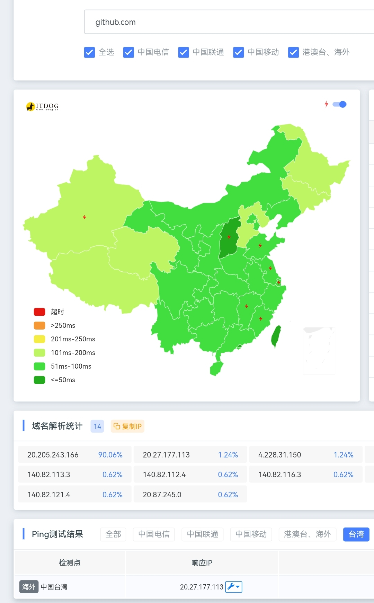

# What is Github？（摘抄至百度百科）
GitHub是一项基于云的服务，为软件开发和Git版本控制提供Internet托管。这有助于开发人员存储和管理他们的代码，同时跟踪和控制对其代码的更改。

# Github目前的情况
在中国大陆有部分可以直连，有部分不可以，特别是使用Wlan上网的（我的手机使用WIFI就连不上，开数据就行），可能有些是可以的，这里以我手机为准

# How to 直连 Github？
这里给出以下办法

## 0、电脑使用有线连接，手机使用移动数据，WIFI可以使用就用WIFI
不会有人连如何打开和连接WIFI都不知道吧？这个不需要出教程的，顺带一提，如果依然不行，你可以先进入Edge浏览器的edge://net-internals/#dns，输入Github.com，先点击Lookup，再点击Clear，清理一下DNS缓存，一般就可以了，如果还是不行，接下来再看看下面的教程


## 1、最简单的办法--使用Watt Toolkit（瓦特工具箱，推荐）
Watt Toolkit，原名steam++，是一个包含多种Steam工具功能的开源工具箱（百度百科）
DownloadURL:[https://steampp.net/download](https://steampp.net/download)
如果你的系统是Win 10及以上，可以使用微软商店下载

下载安装好后，打开，点击Github服务，点击复选框打勾，然后点击一键加速，便可以加速Github达到直链的效果了

## 2、修改Hosts文件（应该只适用于前一段时间Github大量封端口）
打开C:/Windows/System32/drivers/etc/hosts文件，用记事本或其他可以打开的编辑软件，接着划到最下方空白处，添加一条记录，如下

```
//格式为ip地址+github.com，中间空格
20.27.177.113 github.com
```

（权限问题提示不能修改请看文章最底部）
这里的IP地址如何获得，使用[ipdog](https://ipdog.cn)去Ping一下Github.com就行了，选一个没有超时的IP，然后复制上去就行了，我刚刚的记录就是使用IPdog去Ping出来的一个IP



## 3、使用Github Desktop版（只能用于上传下载项目，同样适用于Github大规模封端口）

前往 [GitHub Desktop | Simple collaboration from your desktop](https://desktop.github.com/download/) 下载 Github Desktop软件

若你嫌弃官网下载太慢，可以在 联想软件商店 之类的软件里下载

其次，Baidu上面有很多的都多方法，自己搜搜相关的使用教程，这里是教你如何直连Github，不是教你如何用，顺带一提，用于管理项目挺方便的。

## 4、终极方法：打开VPN
如何使用VPN和如何下载VPN的方法就不介绍了，毕竟懂的都懂～如果是国外用户有国外手机号的那就不用开VPN也能直连

# 权限问题
在第二个方法里可能会出现权限不足的问题，这里推荐一个简单的解决办法

新建一个文本文档，后缀名改为.reg，编辑粘贴以下代码：

接着双击导入成功，右键点击Hosts文件，点击“管理员获得使用权”就可以修改文件力～

```
Windows Registry Editor Version 5.00

[HKEY_CLASSES_ROOT\*\shell\runas]
@="管理员取得所有权"
"NoWorkingDirectory"=""

[HKEY_CLASSES_ROOT\*\shell\runas\command]
@="cmd.exe /c takeown /f \"%1\" && icacls \"%1\" /grant administrators:F"
"IsolatedCommand"="cmd.exe /c takeown /f \"%1\" && icacls \"%1\" /grant administrators:F"

[HKEY_CLASSES_ROOT\Directory\shell\runas]
@="管理员取得所有权"
"NoWorkingDirectory"=""

[HKEY_CLASSES_ROOT\Directory\shell\runas\command]
@="cmd.exe /c takeown /f \"%1\\*\" /r /d y && icacls \"%1\\*\" /grant administrators:F /t"
"IsolatedCommand"="cmd.exe /c takeown /f \"%1\\*\" /r /d y && icacls \"%1\\*\" /grant administrators:F /t"
'''
