## 引言

B站UP主[@**LuoTianyiLover**](https://space.bilibili.com/3493112672422440)在B站已经出过一次完整的教程：[2026年iOS6登陆QQ和微信的终极教程！_哔哩哔哩_bilibili](https://www.bilibili.com/video/BV14oSZBPEPa/?spm_id_from=333.337.search-card.all.click&vd_source=1563440284c89d0819859c530c939980)，但用的是iPad版，所以这次拿iPhone4S做演示，也是他的教程的修改版

### 首先是准备工作

- 一部越狱iPhone/iPad设备

- 一个已经绑定了Facebook的微信号。

  微信不同版本绑定Facebook的方法好像都不一样

  6.x版本：先搜索Facebookapp，启用该功能，接着在设置里绑定

  7.x版本：搜索facebookapp，直接绑定

  8.0-8.0.48/8.0.50需要启用facebookapp功能后在`账户与安全`-`更多安全设置`里查看Facebook绑定

- [点我下载所需文件](https://files.thelittlequtegdh.fun/000-%E6%96%87%E7%AB%A0%E8%B5%84%E6%BA%90/003-%E6%97%A7IOS%E7%99%BB%E5%BD%95%E5%BE%AE%E4%BF%A1%EF%BC%88Facebook%EF%BC%89)，备用链接: [https://yun.139.com/shareweb/#/w/i/2wFGQNZDkZv5p](https://yun.139.com/shareweb/#/w/i/2wFGQNZDkZv5p)

  你们也可以点击[原作者的链接](https://pan.baidu.com/s/1ECButCatj5tdV0tbdm6hAg?pwd=B735)进行下载
  
  > [!NOTE]
  >
  > 经过测试，旧版本微信无法接收来自别人的转账和红包，也不能主动添加好友，只能对方添加好友。

## 配置魔法

首先，要有登录Facebook的魔法，这里主要介绍以下两种：

### 网际直通车法

直接在我的资源站Download就行了，或者也可以去[88ipa站点下载](https://88ipa.com)，下载后可以根据B站UP主@LuoTianyiLover的视频教程配置网际直通车

### 手机ClashMeta同一局域网魔法

在手机上，打开浏览器，搜索Clash，找到官网，下载Clash Meta for Android，plus版的不下，没有局域网连接功能，接着手机添加配置文件（网上自己搜索，我不提供），然后点击`设置`，点击`覆写`，点击`允许来自局域网的连接`，选择`已启用`,如图,然后开启你的梯子。

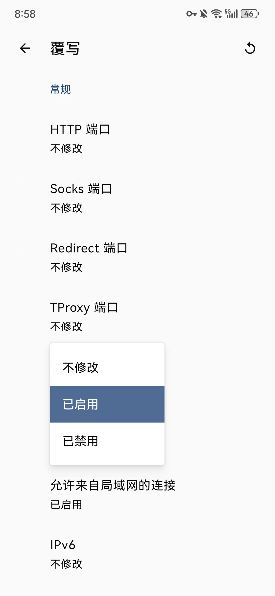

拿出旧设备，确保与你另外一部打开魔法的手机连接到同一局域网下，查看已打开魔法手机的IP地址，复制下来，旧设备找到已经打开魔法的另外一部手机的局域网，点击右边的箭头，找到`http代理`，然后点击`手动`，服务器填写另外一部带了魔法的手机IP，端口填7890，如下图

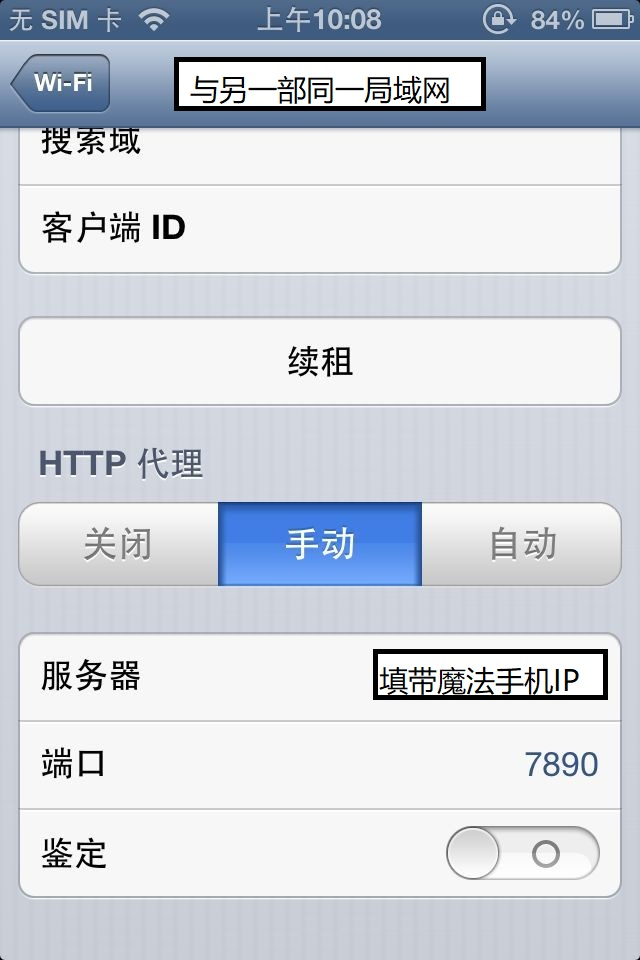

返回，可以看到已经打开魔法了。

## 登录微信的操作

- 切换语言

  在你的旧设备中打开`设置`-`通用`-`多语言环境`-`区域格式`，将其调整到非中国大陆地区，我这里选的是`中国香港特别行政区`，如图

  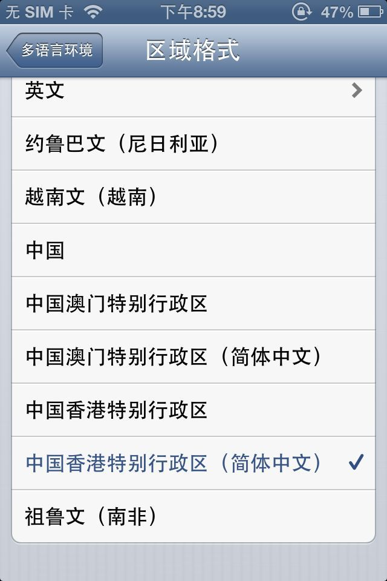

1、按照上方的步骤调整完毕后，清理后台并重新打开微信，点击`登录`，弹出的页面中请选择`使用帐号和密码登录`，下面会有一个`Facebook Connect`的选项，请点击

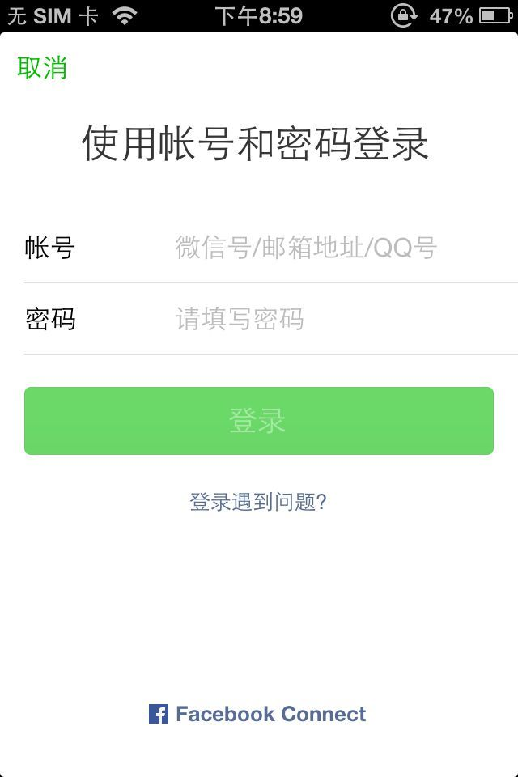

此时应该会分以下两种情况

- ### Facebook客户端能正常登录

  如果你的Facebook能正常使用且能申请登录，那就不需要这么麻烦，直接授权登录即可，然后请直接略过另外一种情况，直接看覆盖安装微信的部分

  > [!NOTE]
  >
  > 登录不上的可以再试试这篇论坛的方法：[在iOS6中使用Facebook的方法 - iOSIPA软件网](https://www.88ipa.com/forum/view/593.html)，毕竟这个方法如果成功了挺方便的，不需要按下面的方法折腾。

  > [!WARNING]
  >
  > 温馨提示：登录完成功进入微信后，千万不要退出后台，不然会提示`微信版本过低`，需要重新登陆。

  

- ### Facebook客户端无法登录或者成功登录但授权页面空白？

  如果你使用上面的方法能正常登录Facebook客户端，但是授权时转圈转很久，白屏或者登录不上Facebook客户端，那么你可以看接下来的步骤

  

  1、先卸载Facebook客户端，清理微信后台，重新打开微信，此时微信找不到Facebook客户端就会自动跳转到Safari浏览器，等待进入登陆页面，同样的，内核太旧导致加载不出来的话多刷新几次，然后就会进入一个界面，界面上的文字全都是乱的（推测是只有手机端才会出现这种情况），此时不要慌张，将页面往下滑，找到`忘记密码`选项，如图：

  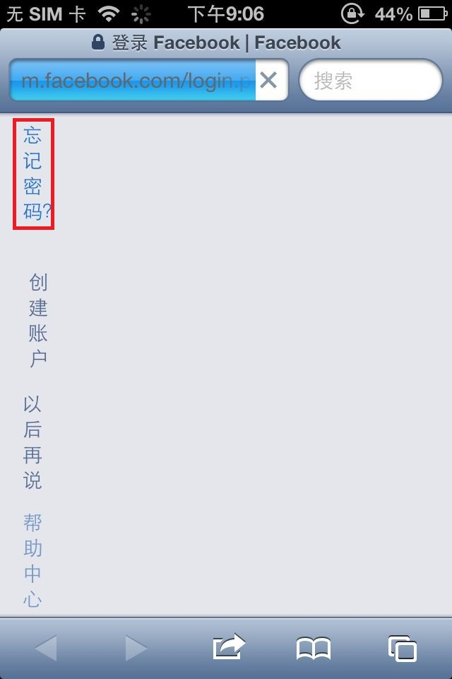

  2、进入到重置密码页面时，请在图中输入框输入你的帐号手机号/邮箱，然后点击带`取消`字样的按钮，由于页面混乱，默认是会有一层`继续按钮`在上面的，不要试图点击下面的`改为根据邮箱或姓名检索`，因为你点不了，如图

  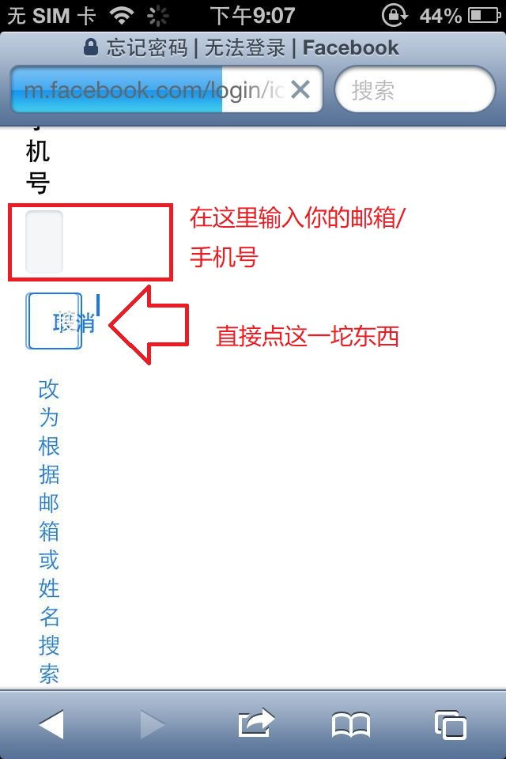

  3、会验证是不是你本人，如果名字匹配就点击是，不匹配就不管它退出重登

  4、到下一步会要求你尝试输入密码，不用尝试，请点击下方的`试试其他方式`

  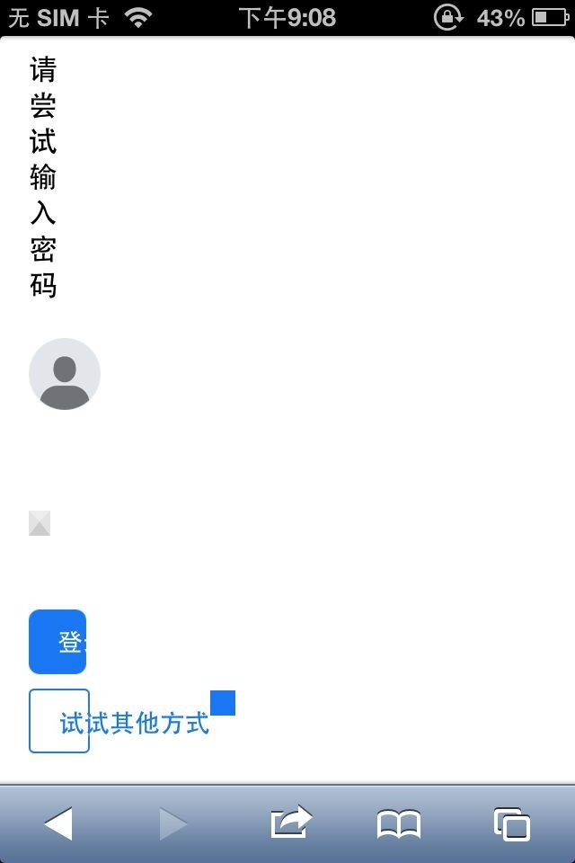

  5、进来后页面如下图，非常混乱，此时不要慌张，一般会提供多个验证方式，单选框对应的是上面文字的验证方式而不是下面文字，一般来说，请选择除了使用密码登录以外的其他验证方式，如果一个不行，换另一个，这里用的是`发送邮件验证码`，接着在弹出的页面验证输入你收到的验证码即可。

  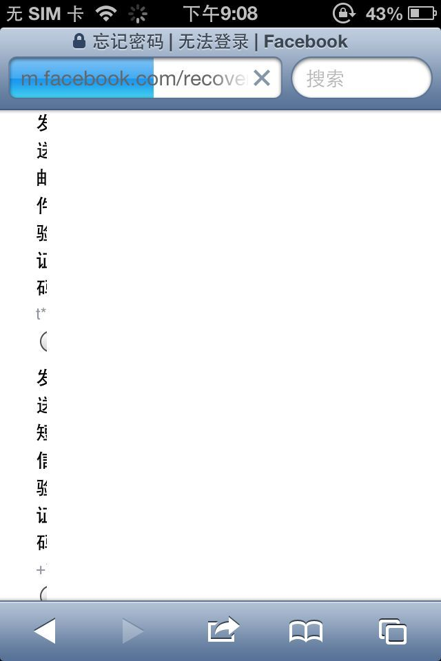

  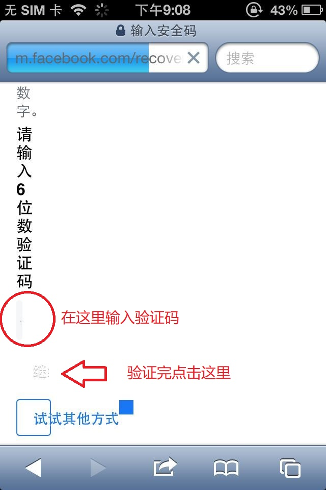

  6、输入完验证码，验证成功会弹出重置密码的页面，此时点击下方的`跳过`按钮

  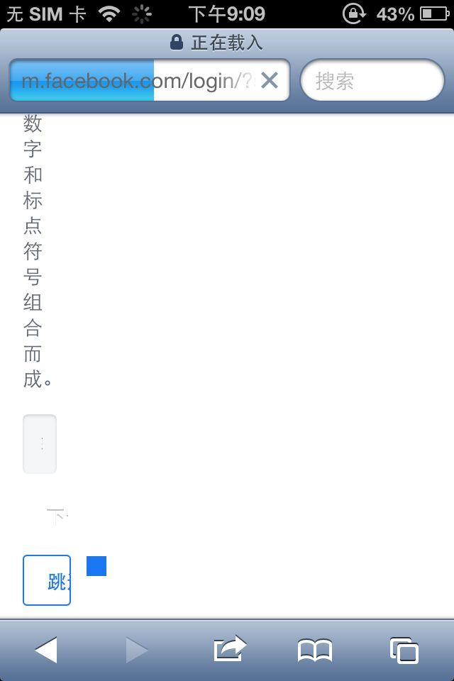

  7、出现这个页面代表你已经登录到了网页端的Facebook（有些情况是空白搜索框，或者是…wrong，这些折腾的时候也遇到过，但似乎也算登录成功）

  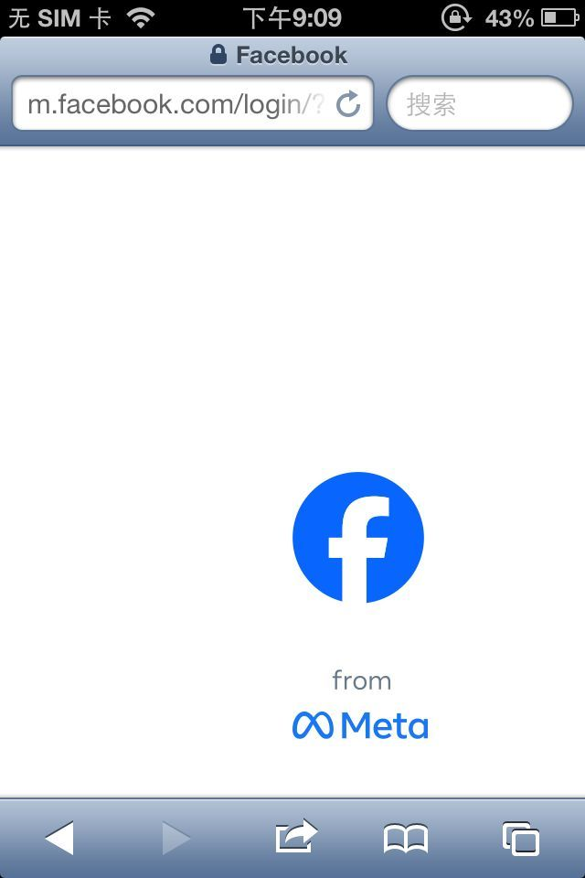

  8、清理Safari和微信的后台进程，重新打开微信使用Facebook Connect进行登录，往下滑，此时不出意外会弹出下图页面，即授权登录，点击`以...的身份继续`，等待几秒，你就可以成功进入微信

  

  > [!WARNING]
  >
  > 温馨提示：此时千万不要退出微信的后台，不然下次重新打开时会显示`微信版本过低`，需要重新登录

  

  ## 覆盖安装微信

  登陆完成后请保持微信进程，不要删后台，打开爱思助手，覆盖安装下载提供的`微信 已修改.ipa`，如果此时设备微信闪退，证明已经安装成功。教程结束

  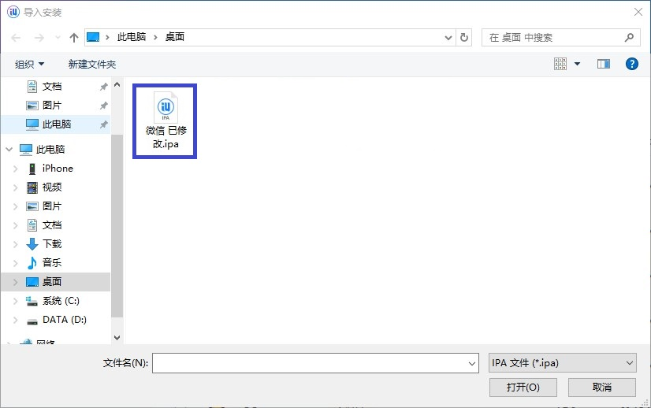

  

