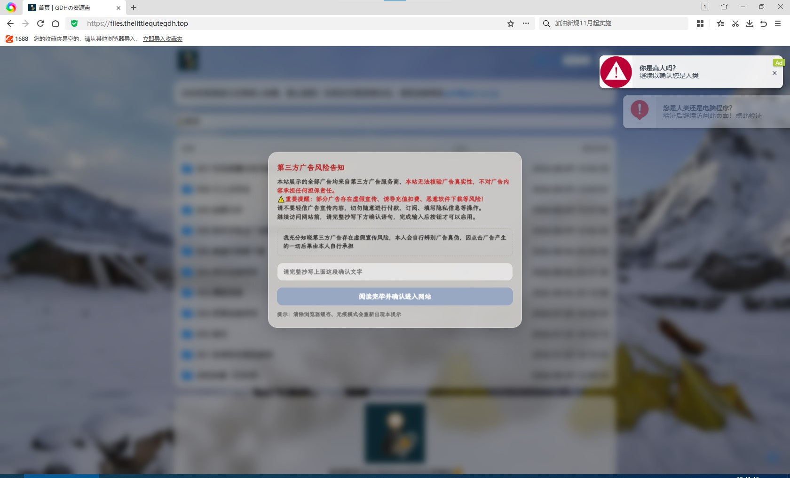
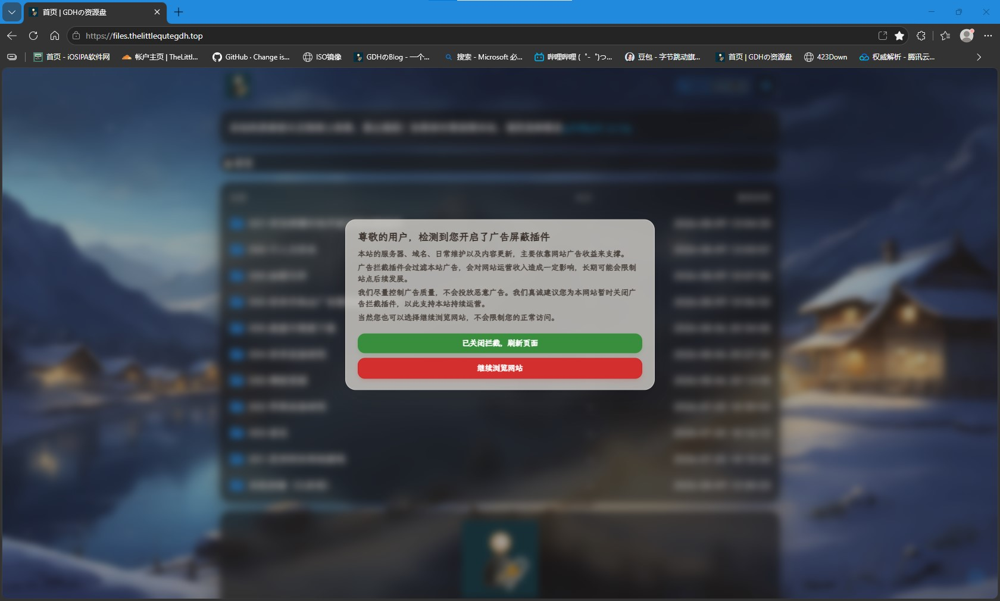

前几天为我的Openlist资源盘添加了广告窗口，但是又又又闲得发慌，所以添加了一个检测窗口：用户开启了拦截广告插件就弹出劝说用户关闭插件的窗口，未开启广告拦截插件就让你输入提示文字，不要相信第三方广告的内容，那么这种窗口怎么写呢（代码并不完善，主要体现在：用户输入确认文字时广告会弹出来，有兴趣的依旧可以修改一下这个代码，谢谢）

### 怎么弄

你得有一个Openlist站点，这里给大家看看我的[演示站](https://files.thelittlequtegdh.top)

效果图如下：





首先，在你的域名后输入/@manage登录并进入后台管理页面，点开`设置`--`全局`，在自定义内容框处直接写入以下代码保存即可

```html
<style>
body.modal-lock {
    overflow: hidden !important;
}
html.modal-lock {
    overflow: hidden !important;
}

.adblock-mask {
    position: fixed;
    top: 0;
    left: 0;
    width: 100vw;
    height: 100vh;
    background-color: rgba(48, 42, 38, 0.42);
    backdrop-filter: blur(6px);
    -webkit-backdrop-filter: blur(6px);
    z-index: 2147483647;
    display: none;
    opacity: 0;
    transition: opacity 0.38s ease;
}
.adblock-mask.show {
    display: block;
    opacity: 1;
}

.adblock-modal {
    position: absolute;
    top: 42%;
    left: 50%;
    width: min(92%, 520px);
    background-color: rgba(252, 248, 243, 0.64);
    backdrop-filter: blur(14px);
    -webkit-backdrop-filter: blur(14px);
    border-radius: 18px;
    padding: 18px 20px;
    transform: translate(-50%, -48%) scale(0.92);
    transition: transform 0.4s cubic-bezier(0.22, 1, 0.36, 1);
    box-shadow: 0 14px 45px rgba(28, 24, 20, 0.22);
    border: 1px solid rgba(255,255,255,0.38);
}
.adblock-mask.show .adblock-modal {
    transform: translate(-50%, -42%) scale(1);
}

.adblock-modal h2 {
    margin: 0 0 10px 0;
    color:#3b322c;
    font-size: 17px;
    font-weight: 600;
    line-height: 1.25;
}
.adblock-modal .text-block {
    color:#4a423c;
    font-size:13px;
    line-height:1.42;
    margin-bottom:16px;
}
.adblock-modal .text-block p {
    margin: 5px 0;
}

.adblock-btn-group {
    display:flex;
    flex-direction: column;
    gap:8px;
}
.adblock-btn-primary {
    padding:8px 20px;
    background-color:#388e3c;
    color:#ffffff;
    border:none;
    border-radius:12px;
    font-size:13px;
    letter-spacing:-0.2px;
    cursor:pointer;
    transition: all 0.24s ease;
    box-shadow: 0 3px 8px rgba(56, 142, 60, 0.20);
}
.adblock-btn-primary:hover {
    background-color:#43a047;
    transform: translateY(-1px);
    box-shadow: 0 4px 11px rgba(56, 142, 60, 0.25);
}
.adblock-btn-primary:active {
    transform: translateY(0);
}

.adblock-btn-secondary {
    padding:8px 20px;
    background-color:#d32f2f;
    color:#ffffff;
    border:1px solid #c62828;
    border-radius:12px;
    font-size:13px;
    letter-spacing:-0.2px;
    cursor:pointer;
    transition: all 0.24s ease;
    box-shadow: 0 3px 8px rgba(211, 47, 47, 0.20);
}
.adblock-btn-secondary:hover {
    background-color:#e53935;
    transform: translateY(-1px);
    box-shadow: 0 4px 11px rgba(211, 47, 47, 0.25);
}
.adblock-btn-secondary:active {
    transform: translateY(0);
}

.adrisk-mask{
    position: fixed;
    top:0;
    left:0;
    width:100vw;
    height:100vh;
    background-color:rgba(20,20,20,0.45);
    backdrop-filter: blur(7px);
    -webkit-backdrop-filter: blur(7px);
    z-index: 2147483647;
    display:none;
    opacity:0;
    transition:opacity 0.35s ease;
}
.adrisk-mask.show{
    display:block;
    opacity:1;
}
.adrisk-modal{
    position: absolute;
    top: 42%;
    left: 50%;
    width: min(92%, 540px);
    background-color:rgba(255,252,248,0.68);
    backdrop-filter: blur(14px);
    -webkit-backdrop-filter: blur(14px);
    border-radius:20px;
    padding:20px 18px;
    transform: translate(-50%, -48%) scale(0.92);
    transition:transform 0.4s cubic-bezier(0.22,1,0.36,1);
    box-shadow:0 12px 40px rgba(0,0,0,0.20);
    border:1px solid rgba(255,255,255,0.4);
}
.adrisk-mask.show .adrisk-modal{
    transform:translate(-50%,-42%) scale(1);
}
.adrisk-modal h3{
    margin:0 0 10px;
    color:#b71c1c;
    font-size:16px;
}
.adrisk-red-warning{
    color:#c62828;
    font-weight:bold;
}
.adrisk-desc{
    font-size:13px;
    color:#3c3834;
    line-height:1.44;
    margin-bottom:14px;
}
.adrisk-quote{
    padding:10px 12px;
    border:1px dashed #bcb2a8;
    border-radius:10px;
    font-size:12.5px;
    color:#333;
    margin-bottom:14px;
}
.adrisk-input{
    width:100%;
    box-sizing:border-box;
    padding:10px 12px;
    border:1px solid #c9c0b4;
    border-radius:12px;
    font-size:13px;
    margin-bottom:14px;
    background:rgba(255,255,255,0.55);
}
.adrisk-btn{
    width:100%;
    padding:10px;
    border:none;
    border-radius:12px;
    background:#99a8c2;
    color:#fff;
    font-size:14px;
    cursor:not-allowed;
    transition:all 0.22s ease;
    pointer-events:none;
}
.adrisk-btn.active{
    background:#5478b8;
    cursor:pointer;
    pointer-events:auto;
}
.adrisk-btn.active:hover{
    background:#6488c8;
}
.adrisk-tip{
    margin-top:10px;
    font-size:11.5px;
    color:#666;
}

.ad-detect-bait {
    position:absolute;
    width:1px;
    height:1px;
    top:-5000px;
    left:-5000px;
}
</style>

<div class="ad-detect-bait ads-box ad-unit ad-slot"></div>

<div class="adblock-mask" id="adBlockMask">
    <div class="adblock-modal">
        <h2>尊敬的用户，检测到您开启了广告屏蔽插件</h2>
        <div class="text-block">
            <p>本站的服务器、域名、日常维护以及内容更新，主要依靠网站广告收益来支撑。</p>
            <p>广告拦截插件会过滤本站广告，会对网站运营收入造成一定影响，长期可能会限制站点后续发展。</p>
            <p>我们尽量控制广告质量，不会投放恶意广告。<strong>我们真诚建议您为本网站暂时关闭广告拦截插件，以此支持本站持续运营。</strong></p>
            <p>当然您也可以选择继续浏览网站，不会限制您的正常访问。</p>
        </div>
        <div class="adblock-btn-group">
            <button class="adblock-btn-primary" id="refreshPageBtn">已关闭拦截，刷新页面</button>
            <button class="adblock-btn-secondary" id="closeTipBtn">继续浏览网站</button>
        </div>
    </div>
</div>

<div class="adrisk-mask" id="adRiskMask">
    <div class="adrisk-modal">
        <h3>第三方广告风险告知</h3>
        <div class="adrisk-desc">
            <p>本站展示的全部广告均来自第三方广告服务商，<span class="adrisk-red-warning">本站无法核验广告真实性，不对广告内容承担任何担保责任。</span></p>
            <p><span class="adrisk-red-warning">⚠️重要提醒：部分广告存在虚假宣传、诱导充值扣费、恶意软件下载等风险！</span></p>
            <p>请不要轻信广告宣传内容，切勿随意进行付款、订阅、填写隐私信息等操作。</p>
            <p>继续访问网站前，请完整抄写下方确认语句，完成输入后按钮才可以启用。</p>
        </div>
        <div class="adrisk-quote">
我充分知晓第三方广告存在虚假宣传风险，本人会自行辨别广告真伪，因点击广告产生的一切后果由本人自行承担
        </div>
        <input class="adrisk-input" id="riskInput" placeholder="请完整抄写上面这段确认文字">
        <button class="adrisk-btn" id="riskConfirmBtn">阅读完毕并确认进入网站</button>
        <div class="adrisk-tip">提示：清除浏览器缓存、无痕模式会重新出现本提示</div>
    </div>
</div>

<script>
(function(){
    const maskDom = document.getElementById('adBlockMask');
    const refreshBtn = document.getElementById('refreshPageBtn');
    const closeTipBtn = document.getElementById('closeTipBtn');
    const riskMask = document.getElementById('adRiskMask');
    const riskInput = document.getElementById('riskInput');
    const riskConfirmBtn = document.getElementById('riskConfirmBtn');
    const targetText = "我充分知晓第三方广告存在虚假宣传风险，本人会自行辨别广告真伪，因点击广告产生的一切后果由本人自行承担";

    function lockPage(){
        document.documentElement.classList.add('modal-lock');
        document.body.classList.add('modal-lock');
    }
    function unlockPage(){
        document.documentElement.classList.remove('modal-lock');
        document.body.classList.remove('modal-lock');
    }

    function checkDomBait(){
        const bait = document.querySelector(".ad-detect-bait");
        const st = window.getComputedStyle(bait);
        return (st.display === "none" || st.visibility === "hidden" || bait.offsetParent === null);
    }

    function checkScriptBait(){
        return new Promise(resolve=>{
            let detected = false;
            const dummyScript = document.createElement("script");
            dummyScript.src = "/fake-ads-detect.js?_="+Date.now();
            dummyScript.onerror = ()=>{ detected=true; resolve(detected); };
            dummyScript.onload = ()=>{ resolve(detected); };
            document.head.appendChild(dummyScript);
            setTimeout(()=>resolve(false),250);
        });
    }

    window.addEventListener('load',async ()=>{
        await new Promise(r=>setTimeout(r,650));
        const domDetect = checkDomBait();
        const scriptDetect = await checkScriptBait();
        const adBlockDetected = domDetect || scriptDetect; //任意一个命中就判定拦截
        const alreadyConfirm = localStorage.getItem("adRiskConfirmed");

        if(adBlockDetected){
            maskDom.classList.add('show');
            lockPage();
        }else{
            if(!alreadyConfirm){
                riskMask.classList.add("show");
                lockPage();
            }
        }
    });

    refreshBtn.addEventListener('click',()=>{
        unlockPage();
        window.location.reload();
    });
    closeTipBtn.addEventListener('click',()=>{
        maskDom.classList.remove('show');
        unlockPage();
    });

    riskInput.addEventListener('input', function(){
        const inputVal = riskInput.value.trim();
        riskConfirmBtn.classList.toggle('active', inputVal === targetText);
    });
    riskConfirmBtn.addEventListener('click',()=>{
        if(riskConfirmBtn.classList.contains('active')){
            localStorage.setItem("adRiskConfirmed","yes");
            riskMask.classList.remove("show");
            unlockPage();
        }
    });
})();
</script>

```

又水一篇文章😊😊😊😊😊😊