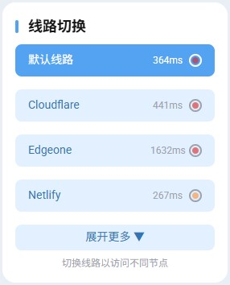

### 引言

闲的发慌啊，直接在Fuwari博客里面添加了这个节点切换器，并且还能测速（每5S测一次延迟，超时会显示TimeOut），配上右边小点点的闪烁动画效果，还是挺好看的，今天来讲一下如何添加吧。



线路过多，所以写了个折叠按钮将多余的线路藏起来

### How To Do？？

首先，访问你的博客项目（本地的或者是Github上的），首先先在..\src\components\widget目录下创建一个名为Routes.astro的文件，写入以下内容（有兴趣的可以自己修改逝逝哦）

```astro
---
import WidgetLayout from "./WidgetLayout.astro";

const defaultRoutes = [
  { name: "默认线路", value: "default", domain: "默认线路的地址" },
  { name: "Cloudflare", value: "cloudflare", domain: "Cloudflare线路地址" },
  { name: "Edgeone", value: "edgeone", domain: "Edgeone线路地址" },
  { name: "Netlify", value: "netlify", domain: "Netlify线路地址" },
  { name: "Aliyun", value: "aliyun", domain: "Aliyun线路地址" },
  { name: "Fastly", value: "fastly", domain: "Fastly线路地址" },
];

const routes = defaultRoutes;
const MAX_VISIBLE = 4;
const COLLAPSED_HEIGHT = "7.5rem";
const isCollapsed = routes.length >= 10;

interface Props {
  class?: string;
  style?: string;
}
const className = Astro.props.class;
const style = Astro.props.style;
---

<WidgetLayout 
  name="线路切换" 
  id="routes" 
  isCollapsed={isCollapsed} 
  collapsedHeight={COLLAPSED_HEIGHT} 
  class={className} 
  style={style}
>
  <div class="flex flex-col gap-4">
    {routes.slice(0, MAX_VISIBLE).map(r => (
      <button 
        class="route-btn w-full flex items-center justify-between btn-regular h-10 px-4 rounded-lg text-left" 
        data-value={r.value}
        data-domain={r.domain}
        aria-label={`切换到 ${r.name}`}
      >
        <span class="flex-1 text-sm">{r.name}</span>
        <div class="flex items-center gap-2 flex-shrink-0">
          <span class="delay-text text-xs text-gray-400 w-10 text-right">--</span>
          <span class="delay-indicator w-4 h-4 rounded-full border-2 border-gray-400 flex items-center justify-center flex-shrink-0">
            <span class="delay-dot w-2 h-2 rounded-full bg-gray-300"></span>
          </span>
        </div>
      </button>
    ))}

    {routes.length > MAX_VISIBLE && (
      <div id="extra-routes" class="flex flex-col gap-4 hidden">
        {routes.slice(MAX_VISIBLE).map(r => (
          <button 
            class="route-btn w-full flex items-center justify-between btn-regular h-10 px-4 rounded-lg text-left" 
            data-value={r.value}
            data-domain={r.domain}
            aria-label={`切换到 ${r.name}`}
          >
            <span class="flex-1 text-sm">{r.name}</span>
            <div class="flex items-center gap-2 flex-shrink-0">
              <span class="delay-text text-xs text-gray-400 w-10 text-right">--</span>
              <span class="delay-indicator w-4 h-4 rounded-full border-2 border-gray-400 flex items-center justify-center flex-shrink-0">
                <span class="delay-dot w-2 h-2 rounded-full bg-gray-300"></span>
              </span>
            </div>
          </button>
        ))}
      </div>
    )}

    {routes.length > MAX_VISIBLE && (
      <button id="toggle-routes" class="btn-regular h-8 text-sm px-3 rounded-lg w-full text-center text-gray-400 hover:text-gray-600 transition">
        展开更多 ▼
      </button>
    )}
  </div>
  <div class="text-xs text-gray-400 mt-2 text-center">这里填写你想在下面显示的小字哦</div>
</WidgetLayout>

<script>
  (function() {
    var hostnameMap = {
      'blog.thelittlequtegdh.top': 'default',
      'cloudflare.thelittlequtegdh.top': 'cloudflare',
      'edgeone.thelittlequtegdh.top': 'edgeone',
      'netlify.thelittlequtegdh.top': 'netlify',
      'aliyun.thelittlequtegdh.top': 'aliyun',
      'fastly.thelittlequtegdh.top': 'fastly',
    };
    var cacheKey = 'delayCache';
    var expireTime = 5000;
    var testCount = 3;
    var singleTimeout = 3000;

    function initRoutes() {
      var currentHost = window.location.hostname;
      var currentRoute = hostnameMap[currentHost] || 'default';
      localStorage.setItem('selectedRoute', currentRoute);

      var buttons = document.querySelectorAll('.route-btn');
      var dotElements = document.querySelectorAll('.delay-dot');
      var textElements = document.querySelectorAll('.delay-text');
      var domainMap = {};
      buttons.forEach(function(btn, idx) {
        var domain = btn.dataset.domain;
        domainMap[domain] = { btn: btn, dot: dotElements[idx], text: textElements[idx] };
      });

      function singleTest(domain) {
        var url = 'https://' + domain + '/?t=' + Date.now() + '&r=' + Math.random();
        var controller = new AbortController();
        var timeout = setTimeout(function() { controller.abort(); }, singleTimeout);
        var start = performance.now();
        return fetch(url, { method: 'GET', mode: 'no-cors', signal: controller.signal })
          .then(function() {
            clearTimeout(timeout);
            return performance.now() - start;
          })
          .catch(function() {
            clearTimeout(timeout);
            return null;
          });
      }

      function testDelay(domain) {
        var tasks = [];
        for (var i = 0; i < testCount; i++) {
          tasks.push(singleTest(domain));
        }
        return Promise.all(tasks).then(function(results) {
          var valid = results.filter(function(t) { return t !== null; });
          if (valid.length === 0) return Infinity;
          valid.sort(function(a, b) { return a - b; });
          if (valid.length >= 3) valid = valid.slice(1, -1);
          var sum = valid.reduce(function(s, v) { return s + v; }, 0);
          return Math.round(sum / valid.length);
        });
      }

      function getColor(delay) {
        if (delay <= 50) return 'bg-green-700 border-green-700';
        if (delay <= 100) return 'bg-green-500 border-green-500';
        if (delay <= 200) return 'bg-green-300 border-green-300';
        if (delay <= 250) return 'bg-yellow-400 border-yellow-400';
        if (delay <= 300) return 'bg-orange-400 border-orange-400';
        return 'bg-red-600 border-red-600';
      }

      function updateDot(dot, text, delay) {
        var color;
        var display;
        if (delay === Infinity || delay === undefined || delay === null) {
          color = 'bg-red-600 border-red-600';
          display = 'TimeOut';
        } else {
          color = getColor(delay);
          display = delay + 'ms';
        }
        dot.className = 'w-2 h-2 rounded-full ' + color + ' delay-dot';
        text.textContent = display;
      }

      var cacheStr = localStorage.getItem(cacheKey);
      var cache = cacheStr ? JSON.parse(cacheStr) : {};
      var now = Date.now();

      function refreshAllDelays() {
        var now = Date.now();
        var domains = Object.keys(domainMap);
        var promises = domains.map(function(domain) {
          return testDelay(domain).then(function(delay) {
            var entry = domainMap[domain];
            updateDot(entry.dot, entry.text, delay);
            cache[domain] = { delay: delay, time: now };
          }).catch(function() {});
        });
        Promise.allSettled(promises).then(function() {
          localStorage.setItem(cacheKey, JSON.stringify(cache));
        });
      }

      var domains = Object.keys(domainMap);
      var pending = domains.length;
      domains.forEach(function(domain) {
        var cached = cache[domain];
        var entry = domainMap[domain];
        if (cached && (now - cached.time) < expireTime) {
          updateDot(entry.dot, entry.text, cached.delay);
          pending--;
        } else {
          testDelay(domain).then(function(delay) {
            updateDot(entry.dot, entry.text, delay);
            cache[domain] = { delay: delay, time: now };
            pending--;
            if (pending === 0) {
              localStorage.setItem(cacheKey, JSON.stringify(cache));
            }
          }).catch(function() {
            pending--;
          });
        }
      });

      if (window._delayTimer) clearInterval(window._delayTimer);
      window._delayTimer = setInterval(refreshAllDelays, expireTime);

      // 折叠/展开按钮（使用 onclick 直接赋值，确保覆盖之前的绑定）
      var toggleBtn = document.getElementById('toggle-routes');
      var extraDiv = document.getElementById('extra-routes');
      if (toggleBtn && extraDiv) {
        toggleBtn.onclick = function() {
          var isHidden = extraDiv.classList.contains('hidden');
          if (isHidden) {
            extraDiv.classList.remove('hidden');
            toggleBtn.textContent = '收起更多 ▲';
          } else {
            extraDiv.classList.add('hidden');
            toggleBtn.textContent = '展开更多 ▼';
          }
        };
      }

      // 线路按钮点击跳转（使用 onclick 直接赋值）
      buttons.forEach(function(btn) {
        if (btn.dataset.value === currentRoute) {
          btn.classList.add('active');
        } else {
          btn.classList.remove('active');
        }
        btn.onclick = function() {
          var domain = this.dataset.domain;
          var value = this.dataset.value;
          localStorage.setItem('selectedRoute', value);
          window.location.href = 'https://' + domain;
        };
      });
    }

    if (document.readyState === 'loading') {
      document.addEventListener('DOMContentLoaded', initRoutes);
    } else {
      initRoutes();
    }

    if (window.swup && window.swup.hooks) {
      window.swup.hooks.on('page:view', initRoutes);
    }
  })();
</script>

<style is:global>
  @keyframes pulse-dot {
    0% { transform: scale(1); opacity: 0.6; }
    50% { transform: scale(1.3); opacity: 1; }
    100% { transform: scale(1); opacity: 0.6; }
  }
  .delay-dot {
    animation: pulse-dot 2s ease-in-out infinite;
  }
  .route-btn.active {
    background-color: var(--primary);
    color: white;
  }
  .route-btn.active .delay-indicator {
    border-color: white;
  }
  .route-btn.active .delay-text {
    color: white !important;
  }
  .route-btn.active .delay-dot {
    border-color: white;
  }
  .delay-indicator {
    border: 2px solid #9ca3af;
  }
  #toggle-routes {
    user-select: none;
  }
</style>
```

添加文件后，修改同目录下的SideBar.astro文件，并引用这个文件：这里展示的是修改后的SideBar.astro文件，可以直接复制使用（如果你之前从未修改过这个文件。）

```astro
---
import type { MarkdownHeading } from "astro";
import Categories from "./Categories.astro";
import Profile from "./Profile.astro";
import Tag from "./Tags.astro";
import Routes from "./Routes.astro";

interface Props {
  class?: string;
  headings?: MarkdownHeading[];
}

const className = Astro.props.class;
---
<div id="sidebar" class:list={[className, "w-full"]}>
    <div class="flex flex-col w-full gap-4 mb-4">
        <Profile />
    </div>
    <div id="sidebar-sticky" class="transition-all duration-700 flex flex-col w-full gap-4 top-4 sticky top-4">
        <Categories class="onload-animation" style="animation-delay: 150ms" />
        <Routes class="onload-animation" style="animation-delay: 200ms" />
        <Tag class="onload-animation" style="animation-delay: 250ms" />
    </div>
</div>
```

在这个代码里面，主要添加了两行代码引用线路切换的文件

```html
import Routes from "./Routes.astro";
.......
<Routes class="onload-animation" style="animation-delay: 200ms" />
```

修改完SideBar文件后，接下来就需要修改..\src\layouts下的Layout.astro文件了，将下面代码复制到<script></script>部分即可

```html
function getRouteUrl(value) {
  const map = {
    default: '默认线路网址',
    cloudflare: 'cf线路网址',
    edgeone: 'eo线路网址',
    netlify: 'netlify线路网址',
    aliyun: '阿里云线路网址',
    fastly: 'fastly线路网址',
  };
  return map[value] || '这里填写默认线路的网址';
}

function applyRoute(value) {
  window.location.href = getRouteUrl(value);
}

window.addEventListener('route-switch', (e) => {
  const { value } = e.detail;
  localStorage.setItem('selectedRoute', value);
  applyRoute(value);
});

window.getCurrentRoute = function() {
  return localStorage.getItem('selectedRoute') || null;
};
window.getCurrentRouteUrl = function() {
  const route = window.getCurrentRoute();
  return route ? getRouteUrl(route) : null;
};

```

最后提交，就可以发现左侧侧边栏线路切换已经生效了。

