## 总所周知，Harmony3-4.2的版本默认强制开启纯净模式，常规办法无法关闭，安装软件时需要花费很长的时间检查软件的安全性，如何永久关闭它？请看以下教程。

本教程适用于Harmony3-4.2或以上的系统

### 开始操作

先下载本文的附件，点击下方按钮下载附件

<p>
  <a href="https://files.thelittlequtegdh.top/000-%E5%8D%9A%E5%AE%A2%E8%B5%84%E6%BA%90/001-%E5%85%B3%E9%97%AD%E7%BA%AF%E5%87%80%E6%A8%A1%E5%BC%8F" download
     style="display:inline-block;background:linear-gradient(135deg,#667eea 0%,#764ba2 100%);color:#fff;padding:12px 24px;margin:5px;border-radius:30px;text-decoration:none;font-weight:bold;box-shadow:0 4px 15px rgba(0,0,0,0.2);">
    下载链接1
  </a>
  <a href="https://wwbfi.lanzn.com/b0139un7je" download
     style="display:inline-block;background:linear-gradient(135deg,#f093fb 0%,#f5576c 100%);color:#fff;padding:12px 24px;margin:5px;border-radius:30px;text-decoration:none;font-weight:bold;box-shadow:0 4px 15px rgba(0,0,0,0.2);">
    下载链接2（密码dx3u）
  </a>
</p>

1、先打开手机的设置，找到`关于手机`，连续点击`HarmonyOS版本`7次，直到打开开发者选项，返回设置，找到`系统和更新`-`开发人员选项`，往下滑找到USB调试，打开

2、打开`搞机工具箱`，拿一条数据线，将你的手机与你的电脑进行连接，等待手机上出现`是否与这台设备进行USB调试`时，点击`允许`。如果搞机工具箱弹出“未检测到设备”，请检查是否已经插好数据线，或者你的电脑是否安装了ADB驱动，可自行百度一下教程

3、在搞机工具箱中找到ADB终端，在顶部的输入框输入以下命令

```
adb tcpip 5555
```

这一步会在你的手机上开启一个5555端口的ADB无线调试，否则接下来你将无法使用Shizuku

4、回到手机，打开Shizuku，找到`通过无线调试启动`，点击启动，在弹出的窗口左下角点击`5555`字样，等待开启成功，期间会问你一遍“是否.........无线调试”，请点击允许。

随后请打开`Scene`，如图所示，请点击“ADB调试”。

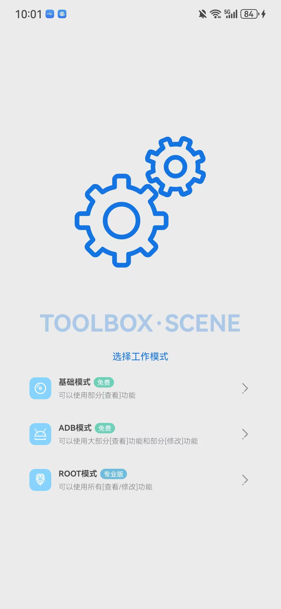

如果你遇到`请通过ADB执行以下代码，激活ADB模式`，请输入如图的代码就可以了，或者你也可以复制以下代码到刚刚你运行adb tcpip 5555的搞机工具箱的ADB终端运行

```
adb shell sh /storage/emulated/0/Android/data/com.omarea.vtools/up.sh
```

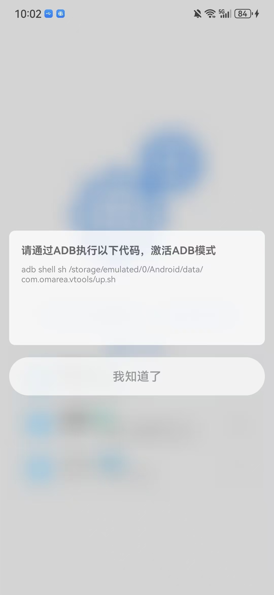

运行完成后，重新点击ADB模式，进入主界面后，点击顶部左上角的`功能`按钮，打开`应用管理`

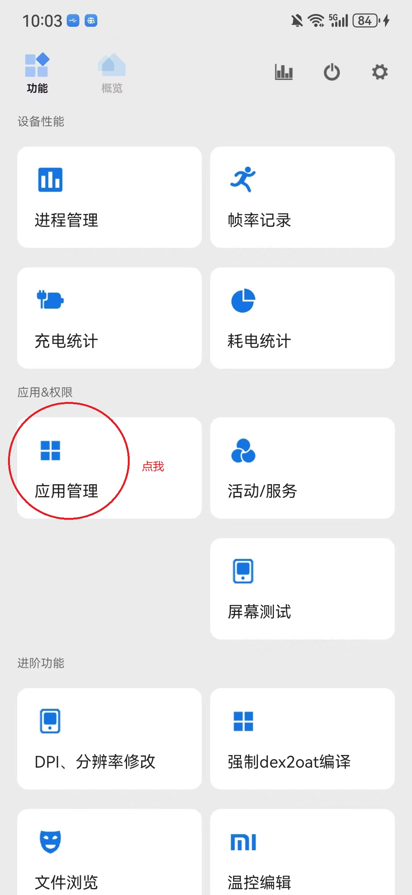

在弹出的窗口里，右上角选择`System`，在下面的搜索框里搜索`安全隐私中心`，如图

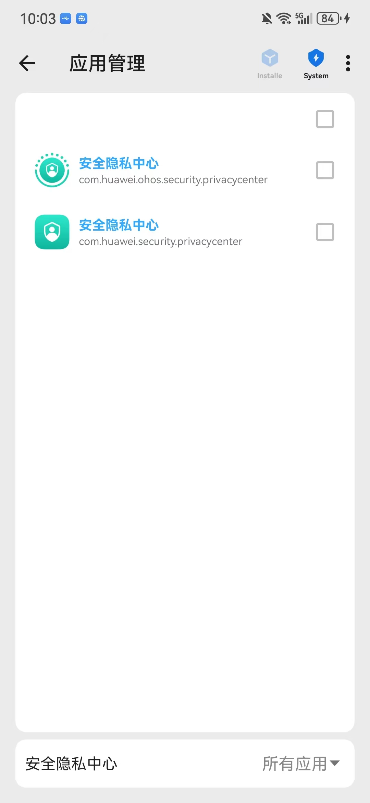

将搜索到的两个结果勾选，点击右下角的“√”，在弹出的页面中选择`从当前用户卸载`，返回显示Success即为成功。

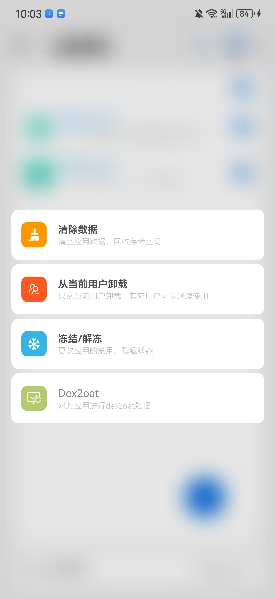

<u>***删除这个的原因是因为通过爱玩机的工具箱关闭纯净模式后，又会自动打开，这两个程序是罪魁祸首。爱玩机的工具箱的作者也意识到这一点，所以将该功能改为临时切换***</u>

5、打开爱玩机的工具箱，除了超级用户以外的权限全部给予，如图，完成这一步操作后点击顶部的“？”，进入主界面

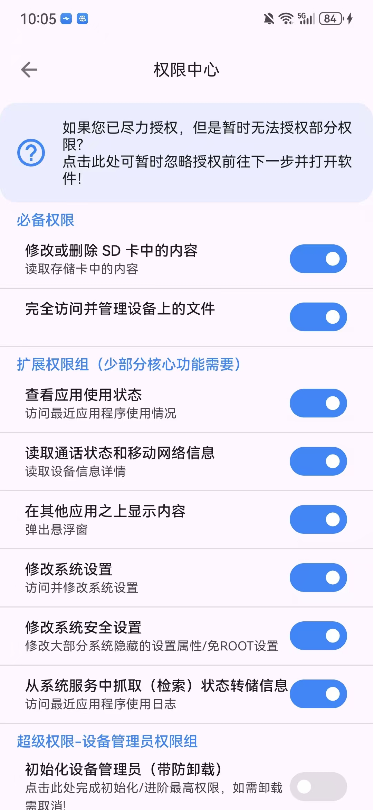

进入主页面后，首次使用需要安装一些依赖文件，按照提示安装即可

安装完毕后，请找到`Harmony专区`，点它

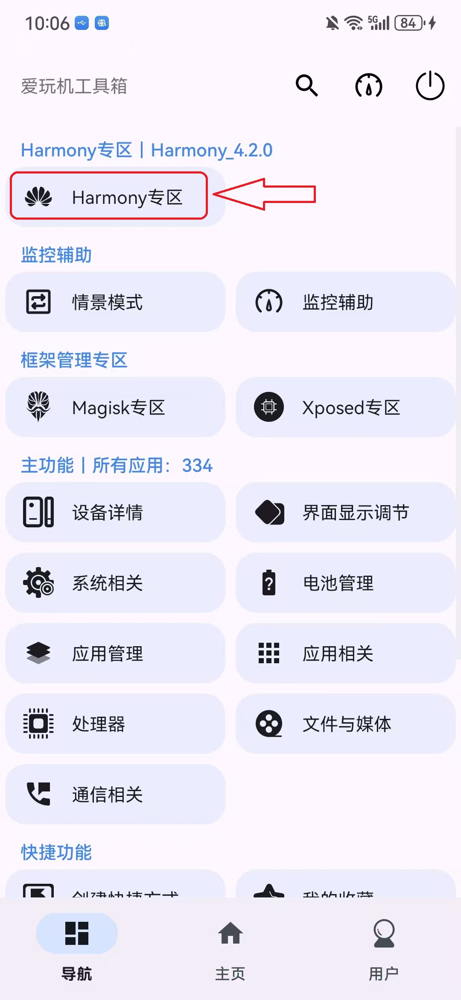

找到`安装器纯净模式`，关闭它，关闭时弹出以下页面，如图，点击临时切换即可永久关闭

<u>**注意，千万不要点击`使用华为安全中心模式`，直接点`临时切换`即可**</u>

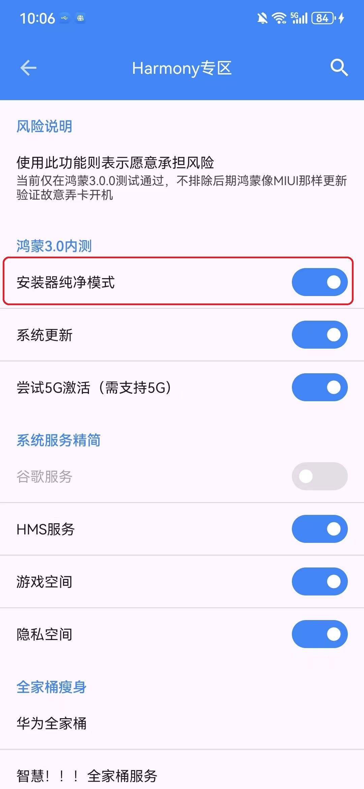

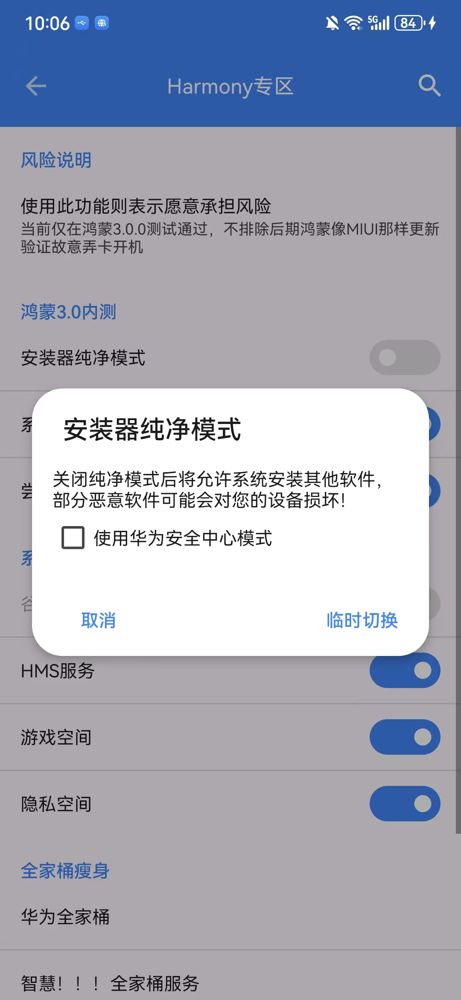

回到爱玩机工具箱的主界面，点击`系统相关`，找到`SetEdit-安卓设置项修改`，如图

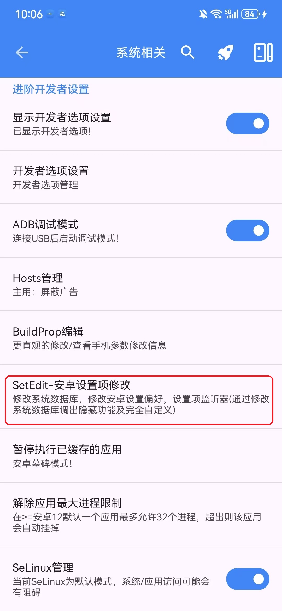

在弹出来的窗口中，点击任务栏的`GLOBAL`,然后在顶部任务栏中查找以下字样：app_check_risk

原先的值为1，1默认为打开状态，点它，将值改为0，也就是关闭，保存更改，重启后就已经完全关闭Hamony3-4.2系统的纯净模式了

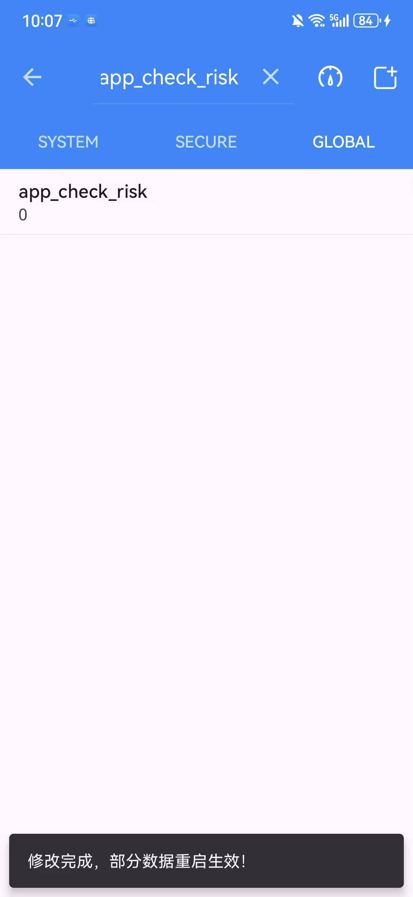
