## 总所周知，华为手机升级到Harmony4.2后，会默认强制开启纯净模式，而且还关不掉，每次安装软件都需要花费很长的时间去检查软件的安全性。所以今天出教程来永久关闭它。

本教程适用于Harmony3-4.2或以上的系统

### 准备工作

一台电脑，和一台已经升级到Harmony3-4.2的华为手机（任意）

你需要在你的手机上安装以下软件：

- Shizuku
- 爱玩机工具箱
- [Scene](https://omarea.lanzout.com/iXTwW3rslz8d)

电脑上需准备好以下程序：

- 搞机工具箱V11

本文的附件下载链接：[点我（蓝奏云下载，密码dx3u）](https://wwbfi.lanzn.com/b0139un7je)

### 开始操作

1、先打开手机的设置，找到`关于手机`，连续点击`HarmonyOS版本`7次，直到打开开发者选项，返回设置的主页，找到`系统和更新`，找到`开发人员选项`，往下滑找到USB调试，打开它

2、打开下载好的`搞机工具箱`，拿一条数据线，将你的华为手机与你的电脑进行连接，等待手机上出现`是否与这台设备进行USB调试`时，点击`允许`。如果搞机工具箱弹出“未检测到设备”，请检查是否已经插好数据线，或者电脑是否安装好ADB驱动，可自行百度一下教程

3、打开搞机工具箱的主页面，找到ADB终端，在顶部的输入框输入以下命令

```
adb tcpip 5555
```

这一步的作用是在你的手机上开启一个5555端口的ADB无线调试，否则接下来你将无法使用Shizuku

4、回到手机，安装好刚刚的三个apk文件，打开Shizuku，找到`通过无线调试启动`，点击启动，在弹出的窗口左下角点击`5555`字样，等待开启成功，期间会问你一遍“是否.........无限调试”，请点击允许。

随后请打开`Scene`，如图所示，请点击“ADB调试”。

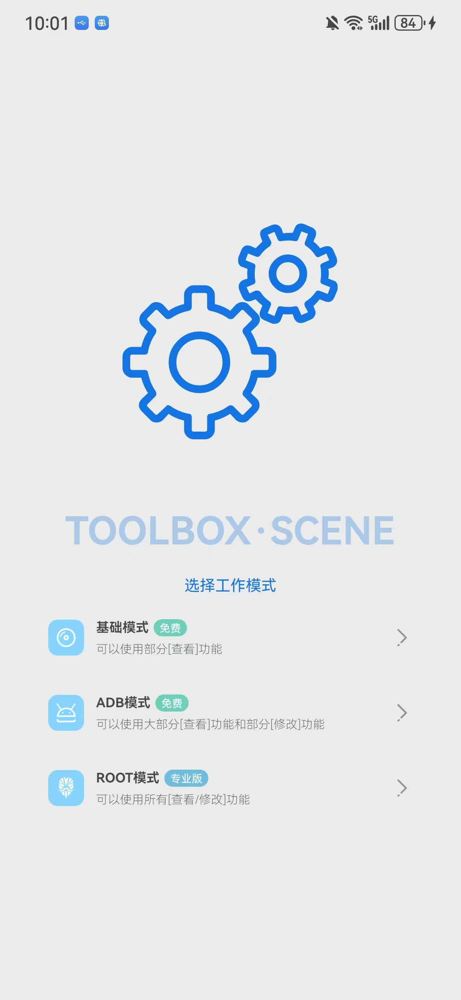

如果你遇到`请通过ADB执行以下代码，激活ADB模式`，请输入如图的代码就可以了，或者你也可以复制以下代码到刚刚你运行adb tcpip 5555的搞机工具箱的ADB终端运行

```
adb shell sh /storage/emulated/0/Android/data/com.omarea.vtools/up.sh
```

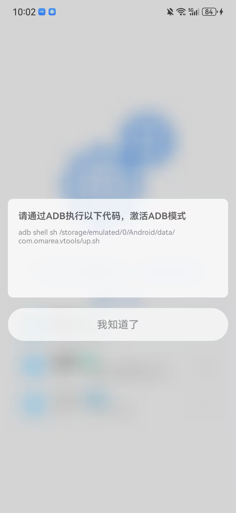

运行完成后，重新点击ADB模式，你会发现你已经进入主界面了，接下来查看顶部左上角有一个`功能`按钮，打开`应用管理`

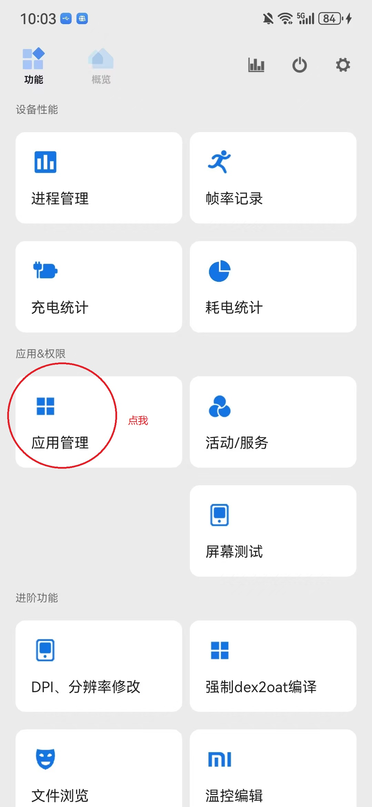

在弹出的窗口里，找到右上角，选择`System`，在下面的搜索框里搜索`安全隐私中心`6个大字，结果如图

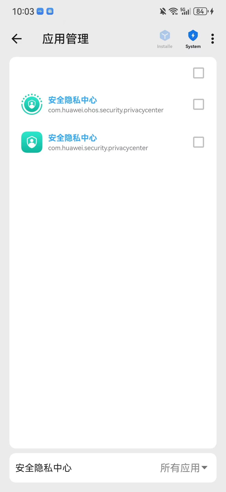

将搜索到的两个结果勾选，点击右下角的“√”，在弹出的页面中选择`从当前用户卸载`，如图

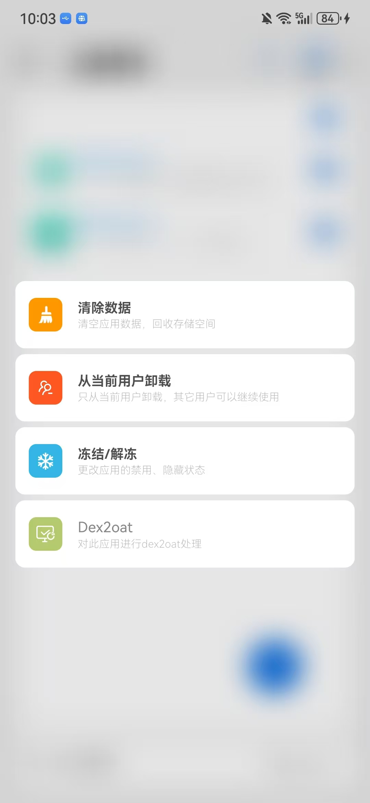

<u>***删除这个的原因是因为爱玩机工具箱的作者关闭了鸿蒙的纯净模式后又会自动打开，这两个程序是罪魁祸首。***</u>

5、打开爱玩机的工具箱，将除了超级用户以外的权限全部给予，如图，完成这一步操作后点击顶部的“？”，进入主界面

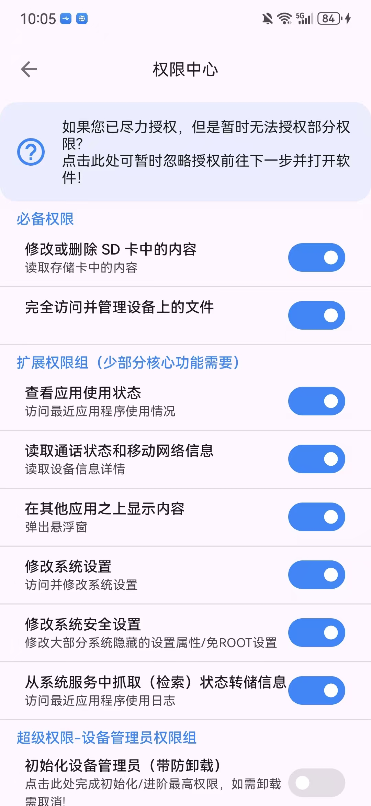

进入主页面后，首次使用需要安装一些依赖文件，按照提示安装即可

安装完毕后，请找到`Harmony专区`，点它

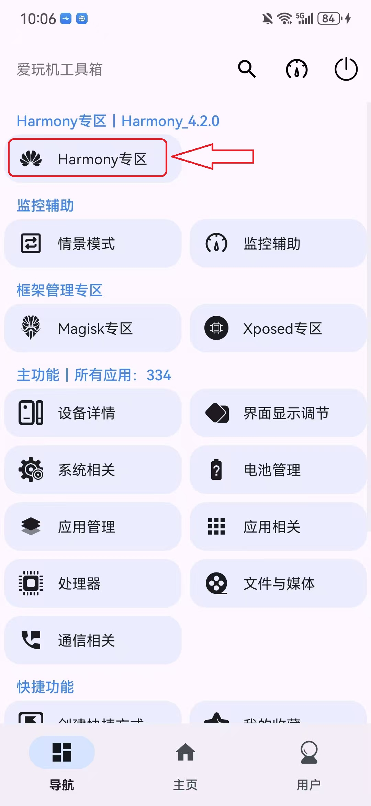

找到`安装器纯净模式`，点右边关闭，关闭时弹出以下页面，如图，具体为什么是`临时切换`，刚刚在删除`安全隐私中心`的时候已经讲过了，但是你现在已经将安全隐私中心卸载了，所以点击`临时切换`的时候就已经时永久关闭了。

<u>**注意，千万不要点击`使用华为安全中心模式`，直接点`临时切换`即可**</u>

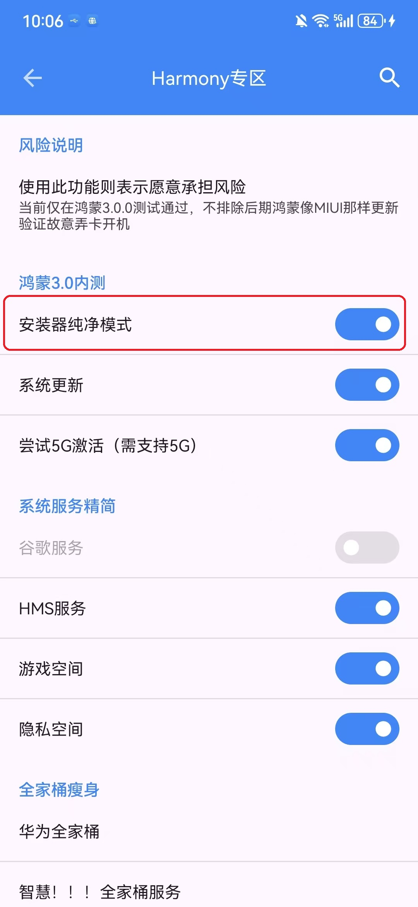

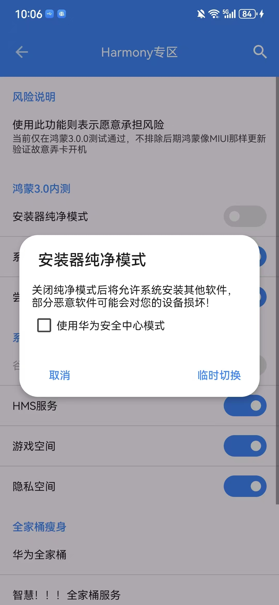

好，纯净模式已经被永久关闭了。现在需要关闭外部应用来源安装检查

回到爱玩机工具箱的主界面，点击`系统相关`，找到`SetEdit-安卓设置项修改`，如图

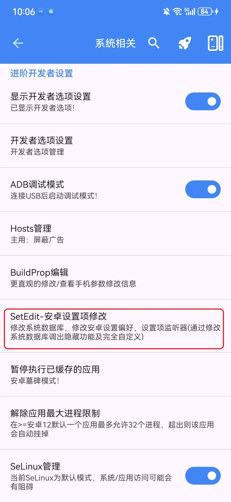

在弹出来的窗口中，点击任务栏的`GLOBAL`,然后在顶部任务栏中查找以下字样：app_check_risk

原先的值为1，1默认为打开状态，点它，将值改为0，也就是关闭，保存更改后，你已经完全关闭Hamony3-4.2系统的纯净模式了

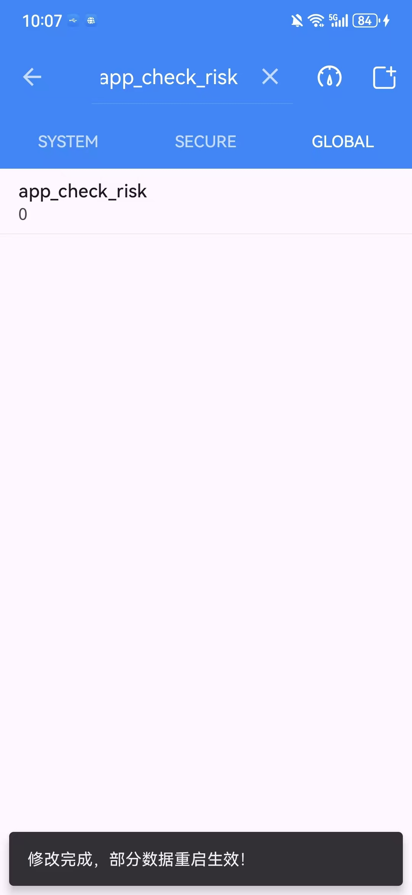

## 至此，教程结束。怎么重启都不会再自动开启纯净模式了。
