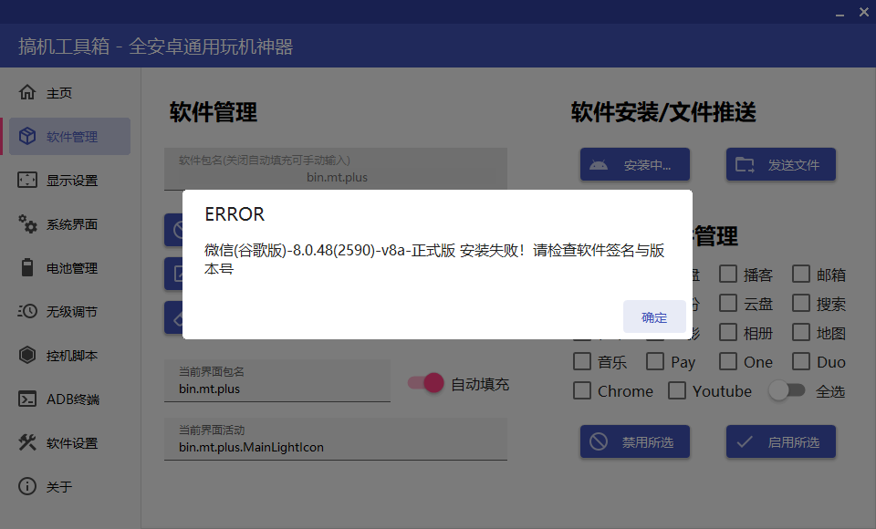
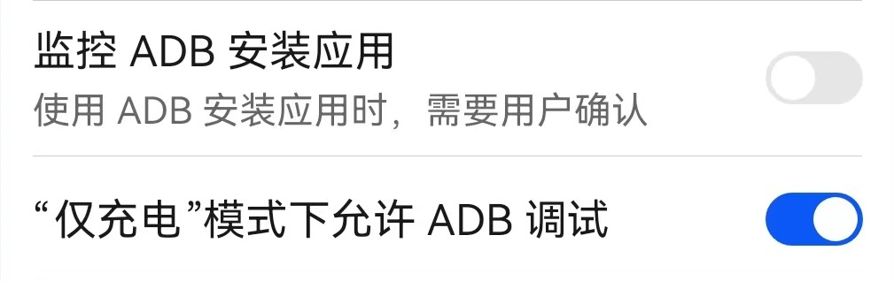
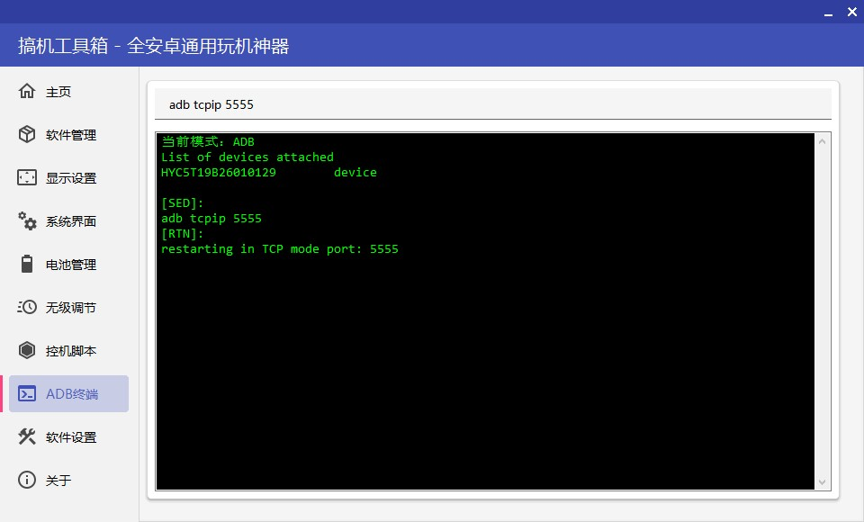
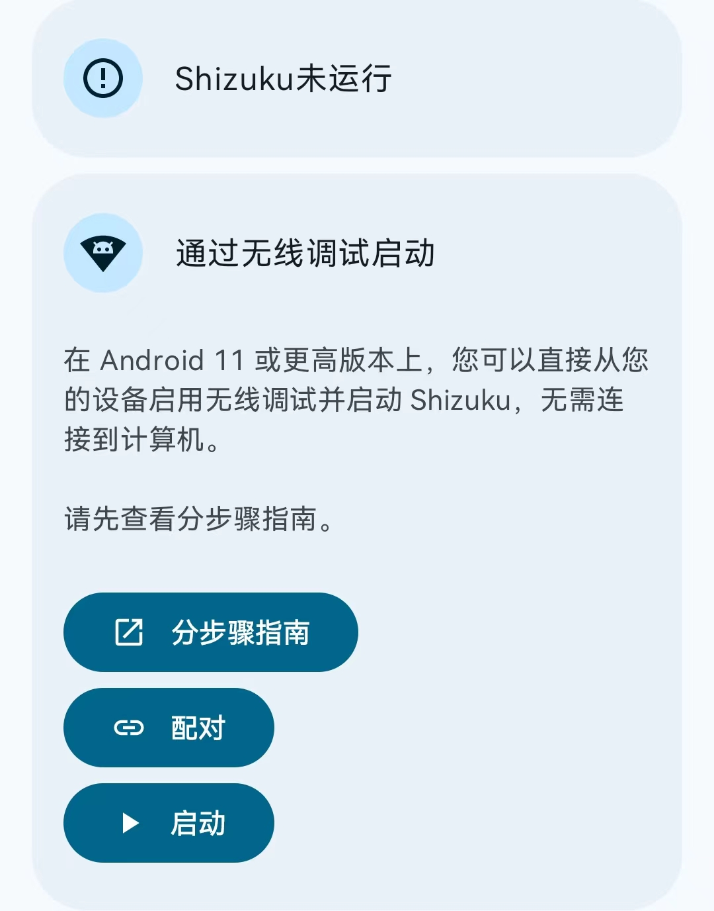
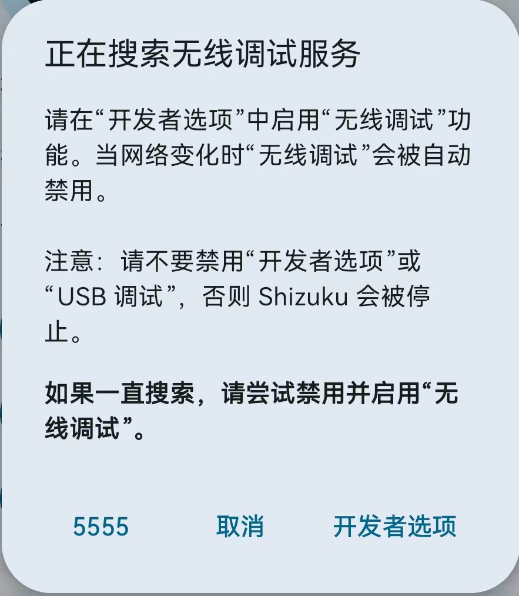
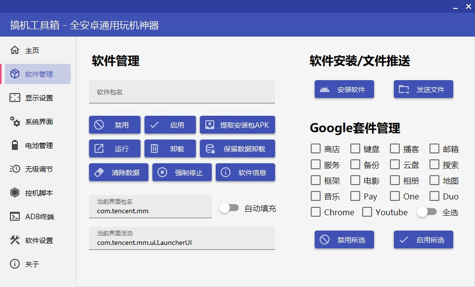
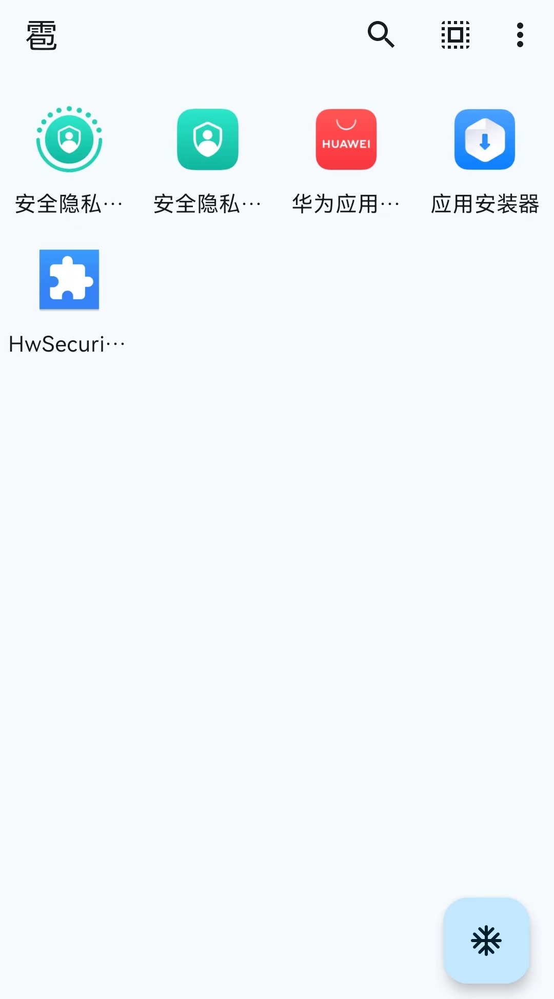
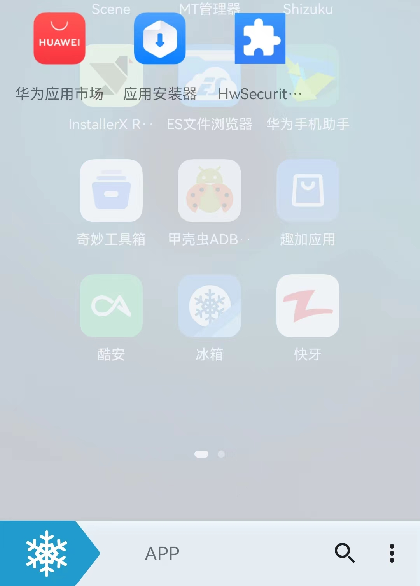

通常我们都不喜欢使用一些软件的新版本，比如微信，新版本实在是太臃肿，为了寻求流畅，一般我们都会选择保留数据进行`降级安装`。但升级到Harmony4.2后，不管是从手机里安装软件，还是通过电脑使用ADB安装软件，都会自动调用系统自带的应用安装器，如果禁用了它，使用其他安装器安装应用时会出现以下提示（以InstallerX为例子）

`No Activity found to handle Intent { act=android.content.pm.action.CONFIRM_INSTALL flg=0x10000000 pkg=com.android.packageinstaller (has extras) }`

如果使用搞机工具箱ADB安装软件则会提示这个



那么这种情况也很好解决，方法如下

## 依旧准备工作

| 准备的Things          | 说明                                                         |
| --------------------- | ------------------------------------------------------------ |
| 一台鸿蒙4及以上的手机 | 本教程适用于Harmony4及以上的手机                             |
| 一台电脑              | Windows8.1以上（应该可以吧）                                 |
| 需要下载的工具        | [下载链接1](https://files.thelittlequtegdh.fun/000-%E6%96%87%E7%AB%A0%E8%B5%84%E6%BA%90/002-%E7%BB%95%E5%8D%8E%E4%B8%BA%E5%AE%89%E8%A3%85%E5%99%A8%E5%AE%89%E8%A3%85Apps )，[下载链接2](https://yun.139.com/shareweb/#/w/i/2w2KQrHeCBwma)，[下载链接3，密码67yz](https://wwbfi.lanzn.com/b0139veygf) |

## 开始操作（配置环境）

### 如果你使用电脑操作，并且你只用电脑安装软件而非手机第三方安装器，你只需要完成下面手机操作的第一步即可

完成后请跳转到`操作`板块

### 如果你使用手机操作，请完成下列步骤打开ADB调试

1、在`关于手机`上连点7次`软件版本`打开开发者模式，回到`系统更新`，点击`开发人员选项`，找到`监控ADB安装应用`，点击关闭。



2、手机与电脑连上数据线，打开`搞机工具箱`，找到`ADB终端`，输入`adb tcpip 5555`启动华为手机的5555端口



3、手机上安装好`Shizuku`，找到`通过无限调试启动`，点击`启动`，弹出来的窗口中点击左下角的`5555`字样。等待ADB启动成功就可以了。期间可能会询问`是否允许....调试`，点击确定就可以了。





## 操作

### 电脑

1、同样是打开搞机工具箱，找到`软件管理`，将下方的`自动填充`关闭，然后点击软件包名，输入下列五个包名，依次点击`禁用`，此时直接安装软件即可

```txt
com.huawei.appmarket
com.android.packageinstaller
com.huawei.securitypluginbase
com.huawei.ohos.security.privacycenter
com.huawei.security.privacycenter
```



> [!CAUTION]
>
> 在下一次重启前，请将这五个包名点击搞机工具箱的启用，启用它们，否则重启的时间异常的长，手机桌面的软件是散开的（即便你之前使用文件夹整理过它们），一定要在重启前启用，包括上一篇教程删除的隐私中心会重新安装，还会还原某些设置

### 手机

#### `雹`的操作步骤

1、下载安装好`雹`后打开，第一次打开需要先配置工作模式，点击下面的`设置`，找到最顶部的`工作模式`，点开选择`Shizuku-停用`


2、点击`应用`，点击上方的漏斗一样的图标，点击`系统`，警告弹窗点击继续，依次搜索下方包名（或者应用名称），分别点击它们的复选框

```txt
华为应用市场-com.huawei.appmarket
应用安装器-com.android.packageinstaller
HwSecurityPluginBase-com.huawei.securitypluginbase
安全隐私中心-com.huawei.ohos.security.privacycenter
安全隐私中心-com.huawei.security.privacycenter
```

3、点击下方的`首页`确实是5个Apps，然后点击右下角的雪图标一键冻结，然后使用第三方安装器即可安装软件



解冻时请点击右上方三个点，点击`解冻可见`即可解冻。

> [!CAUTION]
>
> 在下一次重启前，请将这五个包名解冻，否则重启的时间异常的长，手机桌面的软件是散开的（即便你之前使用文件夹整理过它们），一定要在重启前启用，包括上一篇教程删除的隐私中心会重新安装，还会还原某些设置

#### `冰箱Icebox`安装步骤

下载安装冰箱Icebox，打开，点击右下角的搜索图标，切换`系统`，同样是搜索上面的五个包名或应用名称

```txt
华为应用市场-com.huawei.appmarket
应用安装器-com.android.packageinstaller
HwSecurityPluginBase-com.huawei.securitypluginbase
安全隐私中心-com.huawei.ohos.security.privacycenter
安全隐私中心-com.huawei.security.privacycenter
```

接着点击复选框，返回冰箱主页，检查是否是5个Apps（我这里将安全隐私中心删除了所以只有3个），然后左下角的雪滑块直接一滑就可以了，使用第三方安装器即可安装软件。



解冻方法：长按任意一个Apps，选择所有Apps，在弹出来的窗口点击`解冻`即可

> [!CAUTION]
>
> 在下一次重启前，请将这五个包名解冻，否则重启的时间异常的长，手机桌面的软件是散开的（即便你之前使用文件夹整理过它们），一定要在重启前启用，包括上一篇教程删除的隐私中心会重新安装，还会还原某些设置

至此，教程结束。
