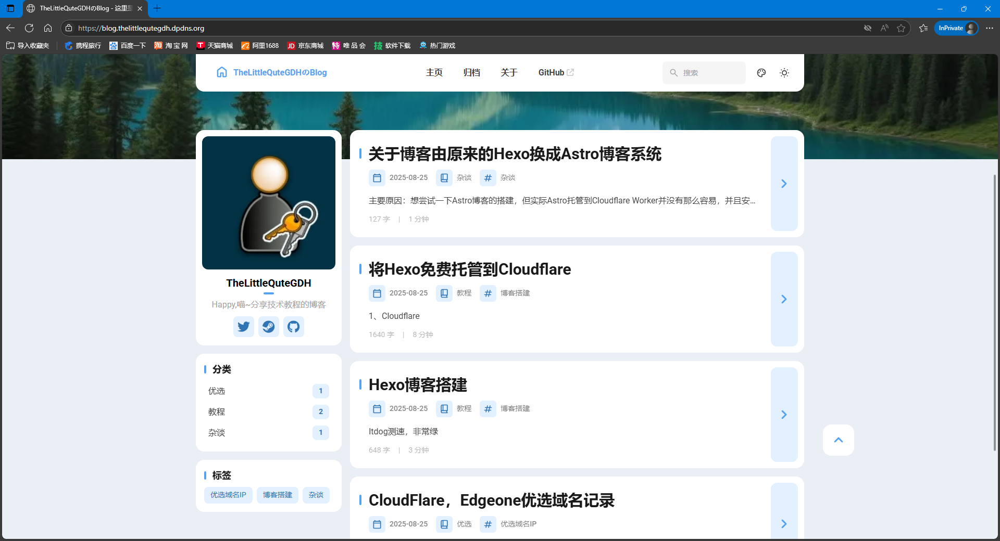

主要原因：想尝试一下Astro博客的搭建，但实际Astro托管到Cloudflare Worker并没有那么容易，并且安装下来个人认为很麻烦
当前博客主题：Astro-Fuwari主题，基于原版修改
接入评论：Giscus评论，使用Github登录即可进行评论，评论管理用Github Discussion功能，支持暗黑模式和白天模式切换

Hexo-theme里的主题个人认为都不好看，有些还很卡，所以转过来Astro博客框架

