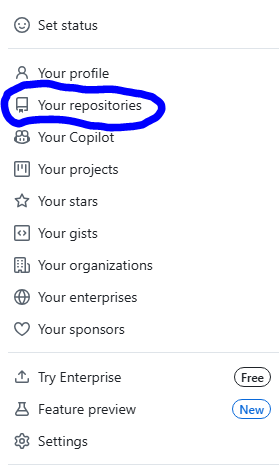
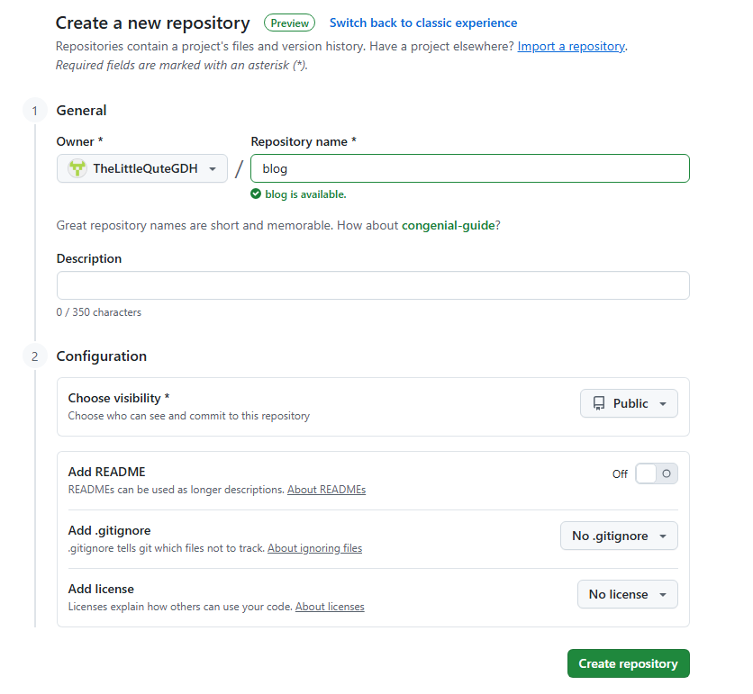

# Hexo博客免费托管到Cloudflare

## 由于本人没有Money买任何的服务器，所以就让赛博大善人CloudFlare帮我托管博客，并且是免费的，无需信用卡和SFZ


## 本期教程有部分照抄自CM大佬的博客[“加速你的项目！详解 Cloudflare Workers & Pages 优选域名设置 | CMLiussss Blog”](https://blog.cmliussss.com/p/BestWorkers/)


## 准备工作

1. 请注册好1个Cloudflare帐号，Cloudflare官网：[https://dash.cloudflare.com，如果卡在加载界面可打开科学上网](https://dash.cloudflare.com)
   
2.准备好1个已经托管到Cloudflare的域名，例如：thelittlequtegdh.dpdns.org或gdh.us.kg，这两个域名都是免费的，可以访问[nic.us.kg](https://nic.us.kg)注册一个类似的域名，教程网上有可以自己百度一下

3. 准备好1个Github帐号，Github官网：[https://github.com](https://github.com)

4.准备一个华为云国际版帐号（如果你使用Cloudflare Worker进行托管，可忽略这一步），华为云国际版官网：[点我进入（如果频繁跳转到中国站登录界面请打开全局代理模式，必须是国际版！）](https://auth.huaweicloud.com/authui/login.html?service=https%3A%2F%2Fconsole-intl.huaweicloud.com%2Fdns%2F#/login)

！注意，免费的二级域名dpdns.org并不能托管至华为云国际版dns服务，如果想托管到华为云dns，请使用us.kg域名（这个要付费￥15）！

## 注册账号

1、Cloudflare的注册

打开Cloudflare官网-点击右上角登录（有账号可直接输入账号密码登录）-点击左下角注册-输入您的电子邮件和密码-选择创建帐户。如果注册失败请百度或必应一下

2、Github的注册

打开Github官网-点击Sign in-填写昵称（用户名）注册邮箱和密码-进行人机验证

3、华为云国际版的注册（如果你使用Cloudflare Worker进行托管，可忽略这一步）

打开华为云国际版官网（国际版不需要实名，如果注册时频繁跳转国内版本，请打开全局代理模式注册）-注册完之后会提示设置您的安全手机，出现这一步就是成功注册了，点击跳过即可-跳转到完善信息页面说明注册已完成，无视绑定提示即可。直接点左上角返回


## 开始托管

### 1、Cloudflare Worker的托管方法

#### Github操作部分

1、在你的Hexo博客目录下，运行**Hexo g**生成网页，打开目录下的“public”文件夹（前提是先编辑好文档再运行命令）

2、打开你注册好的Github，点击右上角头像，点击“Your repositories”




3、再点击右上角带绿色按钮的“New”，新建一个仓库，名字可以随便起，点击Create repository




4、在新建的仓库中，点击issues，点击“Add File“，点击”upload files“，在打开的页面中，回到你创建博客的文件夹，打开public文件夹，将里面所有的内容全部拖到GitHub上传界面中，等到全部上传成功，点击Commit changes，等待一会就可以全部上传了

5、需要在你的仓库中创建一个文件，取名为”wrangler.jsonc“，点击”add file”，选择“create new file”，在路径中修改名字，然后粘贴并修改以下代码


```
{
	    "name": "项目名，与你的Cloudflare项目名相同",
	    "compatibility_date": "2025-08-20",
	    "assets": {
	      "directory": "./"
	    }
	  }
```


#### Cloudflare操作部分（Worker）

1、访问Cloudflare，在侧边栏中点击”计算（workers）“

2、点击右上角”创建“

3、选择workers，并且点击选择”导入存储库“

4、选择Github帐号，并登录自己刚刚创建好的Github帐号，选择刚刚自己创建好的仓库

5、自己创建一个项目名称，例如我这里叫blog，则你修改你刚刚创建的wrangler.jsonc文件的“name”为“blog”，不要勾选非生产分支构建“

6、点击”创建和部署“就可以了，部署完成，但是默认的域名需要科学上网才能打开，这里建议添加自己的域名，回到Workers和pages，点击”设置“，找到域和路由，点击右上角”添加“，选择”路由“，区域选择你已经在cloudflare托管过的域名，路由填写你的域名（比如我在Cloudflare托管的域名为thelittlequtegdh.dpdns.org，则你可以填写”你的前缀“.thelittlequtegdh.dpdns.org/*，例如blog.thelittlequtegdh.dpdns.org）

> [!IMPORTANT]
>
> 这里有个重要事项，添加路由填写的域名后面一定要加/*！！很重要！
>
> 例如，xxxx.com/*

好了，接下来请返回Cloudflare的主界面，找到你的域名，点开，然后找到DNS记录，添加一条CNAME记录，名称填写你的前缀，接着可以填写你自己找的优选域名，关于优选域名记录可以参考这两篇文章[CloudFlare，Edgeone优选域名记录](https://blog.thelittlequtegdh.dpdns.org/2025/08/20/CloudFlare%EF%BC%8CEdgeone%E4%BC%98%E9%80%89%E5%9F%9F%E5%90%8D/)，和[CloudFlare中国大陆地区优选方案汇总](https://blog.cmliussss.com/p/CloudFlare优选/#我维护的优选官方域名，查看更多：https-cf-090227-xyz)

选择一个你喜欢的域名，在你的域名处添加一个cname解析，我这里的名称填写“Blog”，然后目标填写优选域名，**关闭小黄云**点击确定就可以了，至此，worker部分已经完成


#### Cloudflare操作部分（pages）

##### 1、创建pages

pages的话稍稍有些麻烦，先完成Worker部分的1、2步，接着在第三步中，选择Pages，点击“使用直接上传”，你也可以使用“导入现有 Git 存储库”，就像刚刚创建worker一样。创建一个你喜欢的项目名称，例如这里叫“gdhblog”，并上传你博客文件的“public”文件夹下的所有内容，这里不是拖动文件夹，是点击文件夹，拖动里面的所有文件到浏览器，再点击上传，上传成功后，给 Pages 项目添加自定义域，并记录 CNAME 目标域名 “你的项目名称.pages.dev”，例如“gdhblog.pages.dev”，并等待自定义域生效，显示“活动”后，进行下一步

##### 2、使用华为云云解析进行解析

注册部分请跳转到本篇博客的“注册帐号”部分

1、[点我进入华为云解析DNS页面](https://console-intl.huaweicloud.com/dns)，然后点击“公网域名”，然后点击“创建公网域名”

2、填入需要优选的 **Pages 自定义域名**，就是你刚刚在pages步骤添加的自定义域，点击确定，点击你的域名的“管理解析”按钮，点击“添加记录集”，新添加一个`CNAME记录`，线路类型为全网默认，记录值为**Pages 项目分配的域名（你的项目名称.pages.dev），例如gdhblog.pages.dev**，点击“确定”按钮

3、再添加一个**CNAME记录**，线路类型为地域解析` > `中国大陆，记录值为**你自己寻找的优选域名**，比如CM大佬的cf.090227.xyz，鼠标指向第一条NS记录，将4条NS记录值一一复制出来保存好。

4、给你将要使用的域名（比如我这里叫thelittlequtegdh.dpdns.org），添加4条华为云NS类型（就是你刚刚复制出来的那四个）的解析记录，即可生效。

至此，你的个人博客就已经搭建完成了
